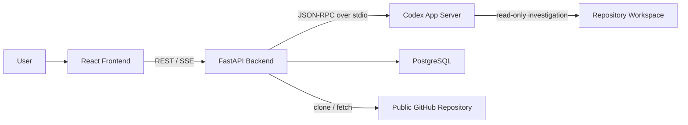

# RepoSpec Viewer 概要仕様

- 文書バージョン: v0.2
- 更新日: 2026-09-30
- ステータス: 初期設計

本文書は、システム境界、主要責務、実装順序を確定するための大枠仕様である。画面の視覚デザイン、全APIの厳密なDTO、DBのDDL、Codexへ渡す完成プロンプトは、対応フェーズの開始時に詳細化する。

## 1. プロダクトの目的

RepoSpec Viewerは、GitHubリポジトリのソースコードをCodex App Serverに調査させ、ユーザーが指定した機能や処理について、読みやすいHTML仕様書を生成・保存・閲覧できるWebアプリである。

中心となる成果物はチャットではなくViewerである。チャットは、Viewerの内容や根拠となるソースコードへ追加質問するための補助機能と位置づける。

## 2. 初期設計の前提

- フロントエンド: React + TypeScript + Vite
- バックエンド: Python + FastAPI
- AI実行基盤: Codex App Server
- 永続化: PostgreSQL
- ブラウザへの逐次配信: SSE
- 対象Repository: MVPではPublic GitHub Repositoryのみ
- Repositoryに対するCodexの権限: 読み取り専用
- 検索方式: MVPではRAGやVector Databaseを使用しない
- 実行形態: 初期版はローカル・単一ユーザーを前提とする

最後の「ローカル・単一ユーザー」は重要な制約である。Codex App Serverが管理するChatGPT認証とローカルWorkspaceを、最初から複数ユーザー間で共有しない。リモート公開やSaaS化は、別途「アプリ独自認証」「ユーザーごとの認証情報隔離」「App Serverプロセス分離」を設計してから行う。

## 3. システム境界



フロントエンドからCodex App Serverへ直接接続しない。FastAPIが認証情報、JSON-RPCのリクエストID、Thread/Turn、承認、エラー、ストリーミングを集約し、ブラウザにはアプリ独自のREST/SSE契約だけを公開する。

## 4. 開発フェーズ

### Phase 0: Codex接続と最小チャット

目的はUIを作り込むことではなく、ブラウザからFastAPIを経由してCodex App Serverの1 Turnを実行できることを確認する。

- App Serverの起動・初期化・終了監視
- ChatGPT認証状態の取得とログイン開始
- 最小のThread作成とTurn実行
- AgentメッセージのSSE表示
- 送信中、完了、失敗、キャンセルの表示
- Codexの作業対象は設定されたテスト用Workspace、権限はread-only

完了条件:

1. 未認証と認証済みをUIで判別できる。
2. テキストを1件送信し、回答を逐次表示できる。
3. 途中で切断・失敗しても、UIが固まらず再試行できる。
4. App Serverを再起動した後も、バックエンドが再初期化できる。

### Phase 1: Repository管理

- GitHub URL登録
- 入力URLの厳密な検証
- 管理対象ディレクトリへのClone
- Repository一覧・詳細・同期
- Branch、Commit SHA、最終同期日時の保存
- Repository単位の排他制御

### Phase 2: Viewer生成と保存

- 生成対象、文書種別、詳細度、対象読者、テーマ、追加指示の入力
- Generation Jobの作成
- CodexによるRepository調査
- 構造化されたViewer Documentの生成
- 検証済みHTMLの生成と保存
- Viewer一覧・詳細・削除・テーマ変更・再生成

### Phase 3: Viewer内Q&A

- Viewer右ペインでの質問
- ViewerごとのConversationとMessage保存
- 回答ストリーミング
- 参照ファイル・行範囲の表示
- Source Code Viewer

### Phase 4: 品質と運用

- 古いCommitから生成されたViewerの警告
- SSE再接続とイベント取りこぼし対策
- 監査ログと機密情報マスキング
- E2Eテスト
- 大規模Repositoryのタイムアウト・キャンセル・容量制限

## 5. Viewerコンテンツ方式

Codexに自由形式のHTML/CSSを直接作らせず、`ViewerDocument`という構造化JSONを正本とする。Codex App ServerのTurnにJSON Schemaを指定し、バックエンドでPydantic検証後にHTMLへレンダリングする。

```text
Codex output (ViewerDocument JSON)
    ↓ Pydantic validation
Trusted renderer template
    ↓ HTML sanitization
Sanitized HTML + Theme CSS
    ↓
Viewer
```

この方式により、テーマ変更をCodexの再実行なしで行え、ソース参照もファイルパス・開始行・終了行の構造化データとして扱える。

## 6. 主要ドメイン

| ドメイン | 責務 |
|---|---|
| Auth | Codex認証状態、ログイン開始、キャンセル、ログアウト |
| Chat | Phase 0用の最小Conversation、Turn実行、ストリーミング |
| Repository | GitHub URL、Clone、Sync、Workspace、Commit SHA |
| Viewer | 生成条件、構造化本文、HTML、テーマ、生成元Commit |
| Generation | Job状態、Codex Thread/Turn、進捗、失敗理由 |
| Conversation | Viewer単位の質問履歴、Codex Threadへの対応 |
| Source Reference | Repository内の相対パス、行範囲、Commit SHA |

## 7. 初期スコープ外

- Private RepositoryとGitHub OAuth
- マルチユーザー/SaaS運用
- Vector Database、Embedding、チャンク管理
- Viewer共有、公開URL、アクセス権管理
- Viewer差分、自動更新、PR連携
- PDF/HTMLエクスポート
- ユーザー定義テーマ
- CodexによるRepositoryの変更

## 8. 仕様書一覧

- [フロントエンド仕様](./frontend-spec.md)
- [フロントエンド用語解説集](./frontend-glossary.md)
- [バックエンド仕様](./backend-spec.md)
- [バックエンド用語解説集](./backend-glossary.md)
- [Phase 1 詳細設計書](./phase-1-detailed-design.md)
- [完成時の画面モック・操作ガイド](./mockups/repospec-viewer-screen-guide.html)

Phaseごとの実装開始前に詳細設計書を追加し、スコープ、状態、API、データ、処理、画面、テスト、完了条件を確定する。

## 9. 要求確定前の論点

1. ローカル単一ユーザー向けを最終形とするか、将来SaaS化するか。
2. Viewerの正本を構造化JSONとし、HTMLを導出データとする方針で良いか。
3. UIライブラリはMUIを使うか、shadcn/ui + Tailwind CSSを使うか。本仕様では「コンポーネント層で隔離する」ところまでとする。

Repositoryの初期上限は[Phase 1 詳細設計書](./phase-1-detailed-design.md)で定義し、実装検証後に調整する。

## 10. 外部仕様

- [Codex App Server - OpenAI Docs](https://developers.openai.com/codex/app-server/)
