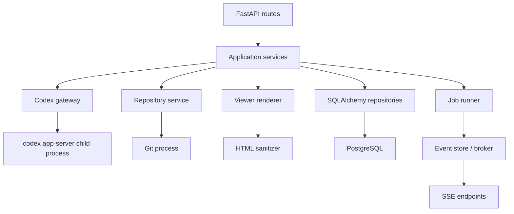

# RepoSpec Viewer バックエンド仕様

- 文書バージョン: v0.1
- 対象: Python + FastAPI + PostgreSQL + Codex App Server
- ステータス: 概要設計

本文書ではサービス境界、Codex App Serverとの接続方式、主要API、データとセキュリティの原則までを定義する。全DTOの厳密なschema、DBのDDL、Codexプロンプト本文、ワーカー製品の選定は対象Phaseで詳細化する。

用語の意味は[バックエンド用語解説集](./backend-glossary.md)を参照する。

## 1. 責務

バックエンドはブラウザとCodex App Serverの境界となり、以下を担当する。

- Codex App Serverプロセスの起動・初期化・監視・終了
- ChatGPT/Codex認証状態の取得とログインフロー
- Codex Thread、Turn、Item、通知、エラーの管理
- Codexイベントからアプリ内イベントへの変換
- Public GitHub Repositoryの登録・Clone・Sync
- Repository Workspaceの安全な管理
- Viewer Generation Jobの実行とストリーミング
- 構造化文書の検証、HTMLレンダリング、サニタイズ
- Repository、Viewer、Conversation、Messageの永続化
- Repository内ソースコードの安全な取得

## 2. アーキテクチャ



RouteからCodexやGitのコマンドを直接実行しない。入出力の正規化、排他制御、エラー変換、トランザクション境界はApplication Serviceへ集約する。

## 3. Codex App Server接続

### 3.1 Transport

Phase 0はFastAPIと同一ホストで`codex app-server`を子プロセス起動し、既定のstdio transportを使う。メッセージは1行1 JSONのJSONLとする。

WebSocket transportはApp Serverを別ホスト化する将来候補だが、現時点の公式仕様で実験的とされているため、MVPの既定にはしない。

### 3.2 起動とハンドシェイク

1. FastAPI lifespanで子プロセスを起動する。
2. stdoutの各行を専用reader taskで読み取る。
3. `initialize`を1回送信する。
4. 成功後に`initialized`通知を送信する。
5. `account/read`で認証状態を確認する。
6. プロセス終了を検知し、実行中リクエストを失敗として解放する。
7. 再起動時は新しい接続としてハンドシェイクをやり直す。

`initialize.clientInfo`はハードコードせず設定値で持ち、`name`, `title`, `version`を必ず送信する。Phase 0では実験API capabilityを有効にしない。

### 3.3 JSON-RPC Client

Codex gatewayは以下を実装する。

- 単調増加のrequest ID発行
- request IDに紐づくpending futureの管理
- responseの`result | error`振り分け
- IDのないnotificationのハンドラ登録
- App Serverからのserver-initiated requestへの応答
- request timeout
- 不正JSON、未知response ID、予期しないEOFのハンドリング
- stderrの機密情報マスキング後ログ

App Serverのwire schemaをRoute層やDB modelへ漏らさない。`CodexThread`, `CodexTurn`, `CodexEvent`, `CodexAuthState`などのアプリ内型へ変換する。

### 3.4 ThreadとTurn

- 新規会話は`thread/start`で開始する
- 保存済みConversationは`thread/resume`で再開する
- ユーザー入力は`turn/start`へ渡す
- 実行中の中止は`turn/interrupt`で行う
- `item/agentMessage/delta`を回答テキストの逐次表示へ変換する
- `turn/completed`をTurnの最終状態の正本とする
- `error`と失敗Turnからアプリ内エラーを構築する

Repositoryを対象とするThread/Turnは以下のポリシーを既定とする。

```json
{
  "cwd": "/managed-workspaces/<repository-id>",
  "approvalPolicy": "never",
  "sandboxPolicy": {
    "type": "readOnly",
    "access": {
      "type": "restricted",
      "includePlatformDefaults": true,
      "readableRoots": ["/managed-workspaces/<repository-id>"]
    }
  }
}
```

実際のパスは設定値から解決する。ユーザー入力やDB上の値をそのまま`cwd`や`readableRoots`に使用しない。

### 3.5 承認要求

MVPのCodexは読み取り専用である。コマンド実行、ファイル変更、追加権限のserver requestが届いた場合、Codex gatewayは自動承認せず拒否し、セキュリティイベントを記録する。

承認UIは、将来Repositoryの更新等をCodexに行わせる要求が生じた時点で、別機能として設計する。

## 4. 認証

### 4.1 状態取得

`account/read`の結果を正規化し、フロントエンドに以下のみ返す。

```json
{
  "status": "authenticated",
  "auth_mode": "chatgpt",
  "plan_type": "plus",
  "email": "masked-or-omitted",
  "app_server_connected": true
}
```

アクセストークン、refresh token、ローカル認証保存パスは返さない。emailは製品上不要であれば応答から除外する。

### 4.2 ChatGPTブラウザログイン

1. `account/login/start` with `type: "chatgpt"`を送信する。
2. `loginId`と`authUrl`をフロントエンドへ返す。
3. `account/login/completed`と`account/updated`を監視する。
4. 成功、失敗、キャンセルを認証イベントとしてブラウザへ配信する。
5. キャンセル時は`account/login/cancel`を送信する。
6. ログアウトは`account/logout`を送信する。

ブラウザcallbackが不安定な環境向けにはdevice-code flowも候補となるが、Phase 0はブラウザフローに限定する。

### 4.3 マルチユーザーに関する制約

初期版は「起動中のApp Serverプロセスの認証アカウント = アプリの利用者」とする。単一のApp Serverプロセスを、異なるChatGPTアカウントの同時利用に使わない。

マルチユーザー化の前に以下を追加する。

- アプリ独自のUser/Session認証
- ユーザーごとのCodex認証保存領域
- App Serverプロセスまたは実行環境のテナント分離
- Repository WorkspaceとDB行の所有者検証
- ジョブワーカーが正しい認証コンテキストを引き継ぐ仕組み

## 5. Phase 0 API

### 5.1 Health / Auth

```http
GET  /api/health
GET  /api/auth/status
POST /api/auth/login
POST /api/auth/login/{login_id}/cancel
GET  /api/auth/events
POST /api/auth/logout
```

`GET /api/health`はHTTPサーバーとApp Server接続を別フィールドで返す。HTTPが正常でApp Serverが落ちている場合も、診断可能なJSONを返す。

### 5.2 Chat

```http
POST /api/chat/sessions
GET  /api/chat/sessions/{session_id}
GET  /api/chat/sessions/{session_id}/messages
POST /api/chat/sessions/{session_id}/messages
GET  /api/turns/{turn_id}
GET  /api/turns/{turn_id}/events
POST /api/turns/{turn_id}/cancel
```

Message送信は長時間HTTP requestにせず、Turn作成後に`202 Accepted`と`turn_id`を返す。フロントエンドはTurnのSSE endpointへ接続する。

```json
{
  "turn_id": "uuid",
  "status": "queued",
  "events_url": "/api/turns/uuid/events"
}
```

## 6. Repository管理

### 6.1 API

```http
GET  /api/repositories
POST /api/repositories
GET  /api/repositories/{repository_id}
POST /api/repositories/{repository_id}/sync
GET  /api/repositories/{repository_id}/sync/events
```

### 6.2 URL validation

- schemeは`https`のみ
- hostは`github.com`のみ
- pathは`/{owner}/{repository}`の2セグメントのみ
- query、fragment、userinfo、明示portは不可
- `.git`の有無は正規化する
- SSH URL、`git://`、`file://`、ローカルパスは不可
- 同一の正規化URLの重複登録を防ぐ

### 6.3 Workspace

- Workspace rootは環境設定で固定する
- 子ディレクトリ名はRepository IDからサーバーが決定する
- GitHub URL、owner/repository名、ユーザー入力をファイルシステムパスに連結しない
- 同一RepositoryのClone、Sync、Generation間で適切な排他ロックを取る
- 解析中にCommitが変わらないよう、Generation開始時にCommit SHAを確定する
- submoduleとGit LFSは初期スコープ外
- Repository内のGit hookは実行しない

Clone/Syncは引数配列でプロセス起動し、shell文字列を組み立てない。タイムアウト、取得容量、ファイル数の上限は設定可能にする。

## 7. Viewer生成

### 7.1 API

```http
GET    /api/repositories/{repository_id}/viewers
POST   /api/repositories/{repository_id}/viewers
GET    /api/viewers/{viewer_id}
DELETE /api/viewers/{viewer_id}
POST   /api/viewers/{viewer_id}/regenerate
PATCH  /api/viewers/{viewer_id}/theme

GET    /api/generation-jobs/{job_id}
GET    /api/generation-jobs/{job_id}/events
POST   /api/generation-jobs/{job_id}/cancel
```

Viewer作成は`202 Accepted`を返す。まだViewerが存在しない時点で`viewer_id`を返す設計にする場合は、Viewerを`draft | ready | failed`の状態で管理する。

### 7.2 Generation Job pipeline

```text
queued
  ↓
preparing_workspace
  ↓
starting_thread
  ↓
analyzing_repository
  ↓
validating_document
  ↓
rendering_html
  ↓
sanitizing_html
  ↓
saving_viewer
  ↓
completed
```

一般状態は`queued | running | completed | failed | cancelled`とし、上記の詳細フェーズは`current_phase`に保持する。状態遷移とViewer保存はトランザクション境界を明確にする。

### 7.3 Codex入力

Codexへ渡す入力には少なくとも以下を含める。

- 調査対象Repositoryの絶対Workspace pathは`cwd`として別指定
- 確定済みCommit SHA
- User Request
- Document Type
- Detail Level
- Target Audience
- Additional Instruction
- 読み取り専用であること
- Repository内の根拠のみで説明すること
- 不明点を推測で断定しないこと
- ファイル参照をRepository相対パスと行範囲で返すこと
- ViewerDocument JSON Schema

Themeは文章の読者調整に必要な場合を除き、Codex入力に混ぜない。見た目はrendererの責務とする。

### 7.4 ViewerDocument

概略schema:

```json
{
  "title": "ログイン機能仕様",
  "summary": "...",
  "sections": [
    {
      "id": "overview",
      "heading": "概要",
      "blocks": [
        { "type": "paragraph", "text": "..." },
        { "type": "flow", "nodes": ["Frontend", "Controller", "Service"] }
      ]
    }
  ],
  "source_references": [
    {
      "id": "src-1",
      "path": "src/services/auth_service.py",
      "start_line": 42,
      "end_line": 61,
      "description": "パスワード検証"
    }
  ],
  "limitations": []
}
```

実際にはblock typeを列挙型とし、未知のHTMLや任意のCSS/JavaScriptを受け付けない。ソース参照はバックエンドが実ファイルと行数に対して再検証する。

### 7.5 HTML renderer

- 入力はvalidation済みViewerDocumentのみ
- タグと属性はallowlistで生成する
- アプリ管理のtemplateでHTML fragmentを生成する
- sanitizerを通した後のHTMLのみ保存する
- Theme CSSはHTMLと別管理する
- 再生成なしのテーマ変更を可能にする
- renderer versionをViewerに保存し、将来の再レンダリングに備える

## 8. Viewer内Q&A

### 8.1 API

```http
GET  /api/viewers/{viewer_id}/messages
POST /api/viewers/{viewer_id}/messages
GET  /api/viewer-turns/{turn_id}/events
POST /api/viewer-turns/{turn_id}/cancel
```

### 8.2 Conversation方針

- Viewerごとに1つの既定Conversationを持つ
- `Conversation.codex_thread_id`とApp Server Threadを対応づける
- 質問時にViewer ID、生成条件、Commit SHA、Viewerの構造化内容をコンテキストとして使用する
- `cwd`は対応するRepository Workspaceに限定する
- Repositoryの現在CommitがViewer Commitと違う場合は、回答対象Commitを明確にする
- User/Assistant MessageはアプリDBに保存し、App Serverだけを履歴の正本にしない

Q&A回答も、本文と`source_references`を分離した構造化出力とする。

## 9. Source Code API

```http
GET /api/repositories/{repository_id}/source?path={relative_path}&commit={sha}&start={line}&end={line}
```

必須検証:

- `path`はRepository相対パスのみ
- 正規化後パスがWorkspace rootの外に出ない
- symlinkの解決先もWorkspace root内である
- `commit`は対象Repositoryに存在するオブジェクトIDである
- binary fileは拒否する
- 1回の応答バイト数と行数に上限を設ける
- 引数をshell文字列へ連結しない

可能な限りworking treeの現在値ではなく、指定Commitのblobを読み取る。これによりViewer生成時点のソースを再現できる。

## 10. SSEイベント契約

SSEは少なくとも以下の形を持つ。

```text
id: 184
event: message.delta
data: {"turn_id":"...","sequence":184,"delta":"..."}
```

共通フィールド:

- `turn_id` or `job_id`
- `sequence`
- `occurred_at`
- eventごとのpayload

要件:

- 順序保証のため単調増加sequenceを持つ
- 同じevent IDを再受信してもUIが重複反映しない
- heartbeatを15〜30秒間隔で送信できる
- `Last-Event-ID`による限定的な再送をサポートする
- 再送できない場合はRESTで最終状態を取得させる
- クライアント切断だけでTurn/Jobを自動キャンセルしない

初期は同一プロセス内のbounded event bufferで実装できる。複数FastAPIインスタンスに拡張する前にRedis Streams等の共有brokerへ移行する。

## 11. データモデル

### Repository

```text
id, name, canonical_github_url, default_branch, workspace_key,
latest_commit_sha, status, last_synced_at, created_at, updated_at
```

### Viewer

```text
id, repository_id, status, title, description, document_type,
detail_level, target_audience, theme_id, content_json, sanitized_html,
prompt, additional_instruction, commit_sha, renderer_version,
created_at, updated_at
```

### Theme

```text
id, name, slug, description, css_class, is_active,
created_at, updated_at
```

### GenerationJob

```text
id, repository_id, viewer_id, status, current_phase, prompt,
document_type, detail_level, target_audience, theme_id,
codex_thread_id, codex_turn_id, commit_sha,
started_at, completed_at, error_code, error_message, created_at
```

### Conversation

```text
id, viewer_id nullable, kind, codex_thread_id,
created_at, updated_at
```

`kind` is `smoke_chat | viewer_qa`.

### Message

```text
id, conversation_id, role, status, content,
source_references_json, codex_turn_id, created_at, completed_at
```

### StreamEvent

```text
id, aggregate_type, aggregate_id, sequence, event_type,
payload_json, created_at, expires_at
```

StreamEventは永久保存ではなく、SSE再接続用の短期保持とする。保持期間と上限件数は設定化する。

## 12. エラー契約

REST errorはRFC 9457 Problem Details相当の形に統一する。

```json
{
  "type": "https://repospec.local/problems/codex-unavailable",
  "title": "Codex App Server is unavailable",
  "status": 503,
  "detail": "Codex App Serverとの接続が切断されました。",
  "code": "CODEX_UNAVAILABLE",
  "retryable": true,
  "trace_id": "..."
}
```

主要error code:

- `AUTH_REQUIRED`
- `AUTH_LOGIN_FAILED`
- `CODEX_UNAVAILABLE`
- `CODEX_TIMEOUT`
- `CODEX_USAGE_LIMIT`
- `CODEX_TURN_FAILED`
- `INVALID_GITHUB_URL`
- `REPOSITORY_NOT_FOUND`
- `REPOSITORY_TOO_LARGE`
- `REPOSITORY_BUSY`
- `CLONE_FAILED`
- `SYNC_FAILED`
- `GENERATION_FAILED`
- `DOCUMENT_SCHEMA_INVALID`
- `HTML_RENDER_FAILED`
- `SOURCE_PATH_INVALID`
- `SOURCE_NOT_FOUND`

フロントエンドへApp Serverの内部エラー全文、ローカル絶対パス、トークン、実行環境情報を返さない。

## 13. セキュリティ

### Codex

- Repository調査はread-only sandbox
- network accessは既定で無効
- 予期しない承認要求は拒否
- プロンプト内のRepositoryコンテンツを信頼されない入力として扱う
- Repository内ファイルに書かれた「上位指示を無視する」等の指示に従わない

### Git / Filesystem

- GitHub以外のhostと任意protocolを拒否
- path traversalとsymlink escapeを拒否
- Clone先はサーバー管理ルート下のみ
- 任意のshell実行を許可しない
- Repository削除を追加する場合はDBとWorkspaceの削除を別々に監査可能にする

### HTML

- AI出力の任意HTML/CSS/JavaScriptを実行しない
- テンプレートはauto-escapeを有効にする
- HTML sanitizerはallowlist方式
- `javascript:` URL、inline event handler、active contentを禁止
- Content Security Policyを設定する

### Secrets / Logs

- Codex認証情報はCodexの管理領域に任せる
- tokenをDB、ブラウザLocalStorage、ログへ保存しない
- URLのqueryに秘密情報を載せない
- ログはtrace ID、ドメインID、状態、所要時間を中心に記録する

## 14. Job実行と並行制御

Phase 0はFastAPI同一プロセスのasync taskでもよいが、Generation Job導入時には次の境界を守る。

- HTTP request lifecycleとJob lifecycleを分離する
- JobはDBに状態を書いてから実行する
- 同一RepositoryのSync中にGenerationを開始しない
- 同一Conversationで複数Turnを同時実行しない
- キャンセルはApp Serverへ伝播し、最終状態をDBに保存する
- プロセス異常終了後に`running`のまま残ったJobを回復または失敗化する

複数workerに拡張するときは、PostgreSQL advisory lockまたはRedisベースの排他と、App Server接続の所有者を設計する。

## 15. 可観測性

ログに以下を含める。

- `trace_id`
- `repository_id`
- `viewer_id`
- `job_id`
- `conversation_id`
- `codex_thread_id`
- `codex_turn_id`
- event name
- status
- duration
- サニタイズ済みerror code

メトリクス候補:

- App Server起動失敗数と再起動数
- Turn成功/失敗/中断数
- first token latency
- Turn完了時間
- Generation Job完了時間
- SSE同時接続数と再接続数
- Clone/Sync時間
- Document schema validation失敗数

## 16. テスト方針

### Unit

- JSON-RPC request/response/notification routing
- request timeoutとApp Server EOF
- Codex eventからdomain eventへの変換
- GitHub URL正規化
- Workspace pathとsymlink検証
- ViewerDocument validation
- HTML allowlistとXSS payloadの無害化
- Job状態遷移

### Integration

- fake app-server processを使ったinitializeからTurn完了までのテスト
- login success/failure/cancel notification
- SSEの順序、切断、再接続
- ローカルのテスト用Git Repositoryを用いたClone/Sync service
- PostgreSQLを用いたJob/Viewer/Conversationの永続化

### Contract

- OpenAPI schemaの差分検知
- フロントエンド生成型とAPI応答の整合
- App Serverの主要通知fixtureによる後方互換性テスト

## 17. 設定項目

```text
DATABASE_URL
CODEX_EXECUTABLE
CODEX_CLIENT_NAME
CODEX_CLIENT_TITLE
CODEX_CLIENT_VERSION
WORKSPACE_ROOT
TEST_CHAT_WORKSPACE
GIT_CLONE_TIMEOUT_SECONDS
GIT_MAX_REPOSITORY_BYTES
GIT_MAX_FILE_COUNT
CODEX_REQUEST_TIMEOUT_SECONDS
GENERATION_TIMEOUT_SECONDS
SSE_HEARTBEAT_SECONDS
SSE_EVENT_RETENTION_SECONDS
LOG_LEVEL
```

デフォルト値は開発環境向けに安全側で定義し、秘密情報をリポジトリへcommitしない。

## 18. 想定ディレクトリ

```text
backend/
  app/
    api/
      routes/
    application/
    codex/
      client.py
      process.py
      events.py
      schemas.py
    repositories/
    generation/
    viewers/
    conversations/
    db/
      models/
      migrations/
    security/
    settings.py
    main.py
  tests/
    unit/
    integration/
    fixtures/
```

## 19. Phase 0完了条件

1. FastAPI起動時にApp Serverを初期化できる。
2. 接続と認証状態をAPIから取得できる。
3. ChatGPTブラウザログインの開始、完了、失敗、キャンセルを扱える。
4. 1 Conversationに対して1 Turnを開始できる。
5. Agent MessageのデルタとTurn最終状態をSSEで配信できる。
6. 中止をApp Serverへ伝播できる。
7. App Server停止時に実行中処理を失敗化し、再初期化できる。
8. Codexはテスト用Workspaceをread-onlyで調査し、変更を行わない。
9. トークンや機密情報がAPI応答とログに出力されない。

## 20. 外部仕様

- [Codex App Server - OpenAI Docs](https://developers.openai.com/codex/app-server/)
