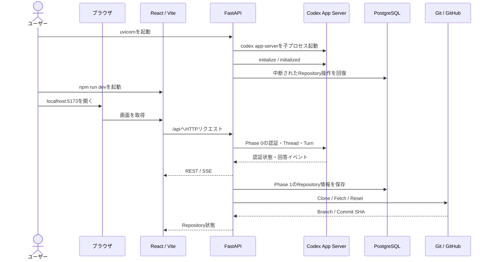

# Phase 0・1 手動テストガイド

- 更新日: 2026-10-08
- 対象: RepoSpec Viewer Phase 0「Codex接続と最小チャット」、Phase 1「Repository管理」
- 想定環境: macOS、PostgreSQL 17、Python 3.12以上、Node.js 24、Codex CLI

この文書は、アプリを手動で起動し、Phase 0とPhase 1の動作をブラウザとAPIから確認するための手順書である。「ユーザーがターミナルで実行するコマンド」と、「画面操作を受けてアプリが内部で実行するコマンド」を分けて記載する。

## 1. 最初に知っておくこと

### 1.1 コマンドの3種類

| 種類 | 実行する人・プログラム | 例 |
|---|---|---|
| ユーザーコマンド | ユーザーがターミナルで実行 | `uvicorn ...`、`npm ...`、`curl ...` |
| HTTP / JSON-RPCコマンド | フロントエンドまたはFastAPIが送信 | `POST /api/repositories`、`thread/start` |
| OSサブプロセス | FastAPIがバックグラウンドで実行 | `codex app-server`、`git clone ...` |

アプリ内部のコマンドは、動作を理解するために掲載している。原則としてユーザーが直接実行する必要はない。

### 1.2 安全上の注意

- 手動テストでは、専用のPublic Repositoryと専用Databaseを使用する。
- `.env`のDatabaseパスワードはGitにコミットしない。手順書やログにも転記しない。
- Phase 1はPublic GitHub Repositoryだけを対象とする。Personal Access Tokenなどの認証情報は入力しない。
- `WORKSPACE_ROOT=.data/workspaces`の場合、手動テスト中はUvicornに`--reload`を付けない。Cloneしたファイルをソースコードの変更と誤認し、バックエンドが再起動するためである。
- 以降の`<...>`は、自分の値へ置き換える箇所を表す。山括弧を含めたまま実行しない。

### 1.3 全体の実行順序

| 順番 | 実行者 | 内容 | 実行頻度 |
|---:|---|---|---|
| 1 | ユーザー | PostgreSQLを起動し、接続を確認 | macOS起動後など |
| 2 | ユーザー | Python、Node.js、`.env`、Databaseを準備 | 初回と構成変更時 |
| 3 | ユーザー | Alembic Migrationを実行 | 初回とschema変更時 |
| 4 | ユーザー | FastAPIを起動 | 毎回 |
| 5 | アプリ | `codex app-server`起動、初期化、Workspace準備、中断状態の回復 | FastAPI起動時 |
| 6 | ユーザー | Viteフロントエンドを起動 | 毎回 |
| 7 | ユーザーとアプリ | Phase 0の認証・チャット・中止・再接続を確認 | 手動テスト時 |
| 8 | ユーザーとアプリ | Phase 1の登録・Clone・重複防止・Sync・失敗・再試行を確認 | 手動テスト時 |
| 9 | ユーザー | `Ctrl+C`でViteとFastAPIを終了 | 手動テスト終了時 |

### 1.4 起動から機能実行までの流れ



## 2. ユーザーが実行するコマンド一覧

### 2.1 初回セットアップ

Repositoryのルートディレクトリへ移動する。

```bash
cd "/Users/futaw/Documents/ChatGPT/ソース解説AIエージェント作成"
```

| コマンド | 起こること |
|---|---|
| `python3 -m venv .venv` | Repository内にPython仮想環境`.venv`を作成する。 |
| `source .venv/bin/activate` | 現在のターミナルで`.venv`のPythonとコマンドを使用する。 |
| `python -m pip install -e '.[dev]'` | FastAPI、SQLAlchemy、Alembic、Uvicorn、テストツールをインストールする。 |
| `cp .env.example .env` | ローカル設定ファイルを作る。既存の`.env`がある場合は上書きしない。 |
| `npm --prefix frontend install` | フロントエンドの依存関係を`frontend/node_modules`へインストールする。 |

`.env`で少なくとも次を確認する。

```dotenv
DATABASE_URL=postgresql+asyncpg://<DB_USER>:<DB_PASSWORD>@127.0.0.1:5432/<DB_NAME>
TEST_CHAT_WORKSPACE=<Codexが読み取るテスト用ディレクトリ>
WORKSPACE_ROOT=.data/workspaces
```

`TEST_CHAT_WORKSPACE` に日本語を含むパスを指定すると、使用するCodex CLIのバージョンによってはコマンド実行時に失敗することがある。その場合は、ASCII文字だけのテスト用ディレクトリを指定する。

### 2.2 PostgreSQLの起動と準備

現在のmacOS環境ではPostgreSQL 17が`/Library/PostgreSQL/17` にある。

```bash
source /Library/PostgreSQL/17/pg_env.sh
sudo launchctl kickstart -k system/postgresql-17
pg_isready -h 127.0.0.1 -p 5432
```

| コマンド | 起こること |
|---|---|
| `source /Library/PostgreSQL/17/pg_env.sh` | `psql`、`createdb`、`pg_isready`などへPATHを通す。 |
| `sudo launchctl kickstart -k system/postgresql-17` | macOSに登録済みのPostgreSQL 17を起動または再起動する。 |
| `pg_isready -h 127.0.0.1 -p 5432` | PostgreSQLが接続を受け付けているか調べる。`accepting connections`なら正常。 |

手動テスト専用Databaseをまだ作っていない場合だけ実行する。

```bash
createdb -h 127.0.0.1 -U postgres repospec_viewer_manual
```

次にMigrationを適用する。

```bash
source .venv/bin/activate
alembic upgrade head
```

`alembic upgrade head`は、`DATABASE_URL`で指定したDatabaseに未適用のschema変更を適用する。現在は`repositories`テーブルを作成するMigrationが含まれる。

### 2.3 毎回の起動

ターミナル1でFastAPIを起動する。

```bash
cd "/Users/futaw/Documents/ChatGPT/ソース解説AIエージェント作成"
source .venv/bin/activate
uvicorn backend.app.main:app --workers 1 --host 127.0.0.1 --port 8000
```

このコマンドはFastAPIを`http://127.0.0.1:8000` で起動する。Phase 1のRepository単位Lockはプロセス内で管理するため、`--workers 1`は必須である。手動テスト中は前述の理由により`--reload`を付けない。

ターミナル2でViteを起動する。

```bash
cd "/Users/futaw/Documents/ChatGPT/ソース解説AIエージェント作成"
npm --prefix frontend run dev
```

Viteは通常`http://localhost:5173` で待ち受け、`/api`のリクエストを`http://127.0.0.1:8000` へ代理送信する。

ターミナル3で起動状態を確認する。

```bash
curl -sS http://127.0.0.1:8000/api/health
curl -sS http://127.0.0.1:8000/api/auth/status
curl -sS http://127.0.0.1:8000/api/repositories
```

期待する状態は次のとおりである。

- Healthの`status`が`ok`。
- Healthの`http_server`が`true`。
- Healthの`app_server_connected`が`true`。
- Repositoryが未登録なら`{"items":[]}`。

### 2.4 終了

フロントエンドとバックエンドを起動したそれぞれのターミナルで`Ctrl+C`を押す。

FastAPIの終了時には次が実行される。

1. 新しいRepository操作の受付を止める。
2. 実行中のCloneまたはSync Taskをキャンセルする。
3. Database接続プールを閉じる。
4. `codex app-server`に終了を要求する。終了しなければ5秒後に強制終了する。

## 3. アプリが実行するコマンド一覧

### 3.1 FastAPI起動時

| 順番 | コマンドまたは処理 | 起こること |
|---:|---|---|
| 1 | Workspace準備 | `WORKSPACE_ROOT`以下に`repositories`、`staging`、`empty-hooks`、`empty-gitconfig`を準備する。 |
| 2 | `codex app-server` | Codex CLIをstdio / JSONLモードの子プロセスとして起動する。 |
| 3 | `initialize` | クライアント名、タイトル、バージョンをCodex App Serverへ送る。 |
| 4 | `initialized` | 初期化完了通知を送る。 |
| 5 | 中断状態の回復 | DBに`pending`、`cloning`、`syncing`が残っていれば`failed / OPERATION_INTERRUPTED`へ変更する。 |

### 3.2 Phase 0のHTTPとJSON-RPC

| ブラウザ操作 | Frontendが送るHTTP | FastAPIがApp Serverへ送るJSON-RPC | 結果 |
|---|---|---|---|
| ログイン画面を開く | `GET /api/auth/status` | `account/read` | 認証済みか未認証かを表示する。 |
| Healthを確認 | `GET /api/health` | なし | HTTP ServerとCodex App Serverの接続状態を返す。Headerは5秒間隔で取得する。 |
| `ChatGPTでログイン` | `POST /api/auth/login` | `account/login/start` | 認証URLを新しいタブで開く。 |
| ログイン中 | `GET /api/auth/events` | App Serverから通知 | SSEで成功、失敗、キャンセルを受け取る。画面は2秒ごとに認証状態も再取得する。 |
| `ログインをキャンセル` | `POST /api/auth/login/{login_id}/cancel` | `account/login/cancel` | 進行中のログインを中止する。 |
| APIでログアウト | `POST /api/auth/logout` | `account/logout` | Codex CLIの認証状態を未認証へ変更する。 |
| Chat画面を開く | `POST /api/chat/sessions` | `thread/start` | 読み取り専用の一時Threadを作る。 |
| 質問を送信 | `POST /api/chat/sessions/{session_id}/messages` | `turn/start` | Turnを開始し、HTTPは`202 Accepted`を返す。 |
| 回答中 | `GET /api/turns/{turn_id}/events` | App Serverから`item/agentMessage/delta` | SSEで回答を少しずつ画面へ反映する。 |
| `中止` | `POST /api/turns/{turn_id}/cancel` | `turn/interrupt` | 実行中のTurnを中止する。 |

ブラウザ画面からは通常呼ばないが、Chatの状態確認用に次のAPIも実装されている。

| HTTP | 返す内容 |
|---|---|
| `GET /api/chat/sessions/{session_id}` | Sessionが`idle`か`running`かを返す。 |
| `GET /api/chat/sessions/{session_id}/messages` | そのSessionのUser・Assistant Messageを返す。 |
| `GET /api/turns/{turn_id}` | Turnの`queued / running / completed / failed / cancelled`を返す。 |

`thread/start`と`turn/start`では、`TEST_CHAT_WORKSPACE`を作業場所に指定する。承認ポリシーは`never`、sandboxは`readOnly`、Turnのネットワーク接続は無効である。コマンド実行、ファイル変更、追加権限の承認要求がApp Serverから届いた場合、FastAPIは自動承認せず拒否する。

### 3.3 Phase 1のHTTPとGitサブプロセス

#### Repository一覧

| ブラウザ操作 | Frontendが送るHTTP | 起こること |
|---|---|---|
| Repositoriesを開く | `GET /api/repositories` | 更新日時の新しい順で一覧を取得する。 |
| 処理中の行がある | `GET /api/repositories`を2秒間隔 | `pending`、`cloning`、`syncing`がなくなるまでポーリングする。 |
| Dashboardを開く | `GET /api/repositories/{repository_id}` | 1件の状態、Branch、Commit SHA、最終同期日時、公開可能なエラーを取得する。 |
| Dashboardの対象が処理中 | `GET /api/repositories/{repository_id}`を2秒間隔 | `ready`または`failed`になるまでポーリングする。 |

#### Repository登録とClone

| 順番 | HTTPまたは内部コマンド | 起こること |
|---:|---|---|
| 1 | `POST /api/repositories` | URLを検証・正規化し、`pending`のDB行を作る。すぐに`202 Accepted`を返す。 |
| 2 | 非同期Clone Task | Repository単位のLockを取り、状態を`cloning`へ変更する。 |
| 3 | `git <safe-options> clone --no-tags --origin origin -- <url> <staging>` | 一時ディレクトリへ履歴を省略せずCloneする。 |
| 4 | `git -C <staging> remote get-url origin` | Clone先の`origin`が登録URLと一致するか確認する。 |
| 5 | Workspace容量の集計 | symlinkを辿らず`.git`を含む容量を確認する。既定の上限は1 GiB。 |
| 6 | `git -C <staging> ls-files -z` | 追跡ファイル数を確認する。既定の上限は100,000件。 |
| 7 | `git -C <staging> symbolic-ref --short refs/remotes/origin/HEAD` | Default Branchを取得する。 |
| 8 | `git -C <staging> rev-parse HEAD` | 40文字のCommit SHAを取得する。 |
| 9 | `rename(<staging>, <repository-workspace>)` | 検証済みのCloneをUUID名の確定Workspaceへ移す。 |
| 10 | DB更新 | `ready`、Default Branch、Commit SHA、最終同期日時を保存する。 |

`<safe-options>`は次のGit設定である。

```text
-c credential.helper=
-c core.hooksPath=<WORKSPACE_ROOT>/empty-hooks
-c protocol.file.allow=never
-c http.followRedirects=false
```

さらに、Gitプロセスでは次の環境変数を使う。ユーザーのGitHub CLI認証やGit設定を引き継がないための設定である。

```text
GIT_TERMINAL_PROMPT=0
GIT_CONFIG_GLOBAL=<WORKSPACE_ROOT>/empty-gitconfig
GIT_CONFIG_SYSTEM=<WORKSPACE_ROOT>/empty-gitconfig
GIT_CONFIG_NOSYSTEM=1
GIT_ASKPASS=
SSH_ASKPASS=
```

#### 最新コードの取得

| 順番 | HTTPまたは内部コマンド | 起こること |
|---:|---|---|
| 1 | `POST /api/repositories/{repository_id}/sync` | `ready`または`failed`から処理を開始し、`202 Accepted`を返す。 |
| 2 | `git -C <workspace> remote get-url origin` | 登録URLと現在の`origin`が一致するか確認する。 |
| 3 | `git -C <workspace> <safe-options> fetch --no-tags origin` | GitHubから最新のCommitとrefを取得する。 |
| 4 | `git -C <workspace> <safe-options> remote set-head origin -a` | `origin/HEAD`をGitHub側のDefault Branchへ合わせる。 |
| 5 | `git -C <workspace> symbolic-ref --short refs/remotes/origin/HEAD` | Default Branchを取得する。 |
| 6 | `git -C <workspace> reset --hard refs/remotes/origin/<default-branch>` | 管理Workspaceを最新Commitへ合わせる。 |
| 7 | `git -C <workspace> -c core.hooksPath=<empty-hooks> clean -ffdx` | 管理Workspaceの未追跡ファイルと無視ファイルを除き、GitHub上の状態へ揃える。 |
| 8 | 容量、ファイル数、Commit SHA検証 | 上限とメタデータを確認する。 |
| 9 | DB更新 | `ready`へ戻し、最新のBranch、SHA、最終同期日時を保存する。 |

Syncは管理Workspaceを`reset --hard`と`clean -ffdx`でGitHub上の状態へ揃える。管理Workspaceを人が作業用ディレクトリとして使用してはならない。

## 4. Phase 0の手動テスト

### 4.1 起動と認証状態

1. `http://localhost:5173` をブラウザで開く。
2. 未認証ならLogin画面、認証済みならChat画面が表示されることを確認する。
3. Headerの表示が`App Server 接続済み`になることを確認する。

直接APIで確認する場合は次を実行する。

```bash
curl -sS http://127.0.0.1:8000/api/health
curl -sS http://127.0.0.1:8000/api/auth/status
```

### 4.2 ログインとキャンセル

ログインは次の順で確認する。

1. `ChatGPTでログイン`を押す。
2. 新しいタブでChatGPT認証を完了する。
3. 元のタブがChat画面へ移動することを確認する。

キャンセル確認は、認証前の環境で次のように行う。

1. `ChatGPTでログイン`を押す。
2. ChatGPT側のログインを完了する前に、`Loginをキャンセル`を押す。
3. `ログインをキャンセルしました。`と表示されることを確認する。

ログアウトAPIを確認する場合は、すべてのChatテストの後に次を実行する。

```bash
curl -i -X POST http://127.0.0.1:8000/api/auth/logout
```

実行するとCodex App Serverの`account/logout`が呼ばれ、ローカルのCodex CLIが未認証になる。後続テストでは再ログインが必要になる。

### 4.3 チャット完了

1. Headerから`Chat`を開く。
2. 入力欄が有効になるまで待つ。
3. `このWorkspaceのトップレベルにあるファイル名を3つ教えてください。ファイルは変更しないでください。`など、`TEST_CHAT_WORKSPACE`に関する読み取り専用の質問を送る。
4. `考えています…`から回答文が少しずつ増えることを確認する。
5. 完了後に入力欄と送信ボタンが再び使えることを確認する。
6. `TEST_CHAT_WORKSPACE`のファイルが変更されていないことを`git status --short`などで確認する。

### 4.4 チャット中止と再送信

1. 回答に時間がかかる質問を送る。
2. 回答中に`中止`を押す。
3. 回答が止まり、入力欄が再び有効になることを確認する。
4. 新しい質問を送れることを確認する。

回答失敗時は、画面に`同じ内容を再送信`が表示される。そのボタンから直前の質問を再実行できることを確認する。

### 4.5 Codex App Serverの切断と自動再接続

このテストは、必ず手動テスト用のFastAPIで行う。

1. 実行中の`codex app-server`のPIDを調べる。

   ```bash
   ps -axo pid,ppid,command | grep '[c]odex app-server'
   ```

2. 表示された行がこのアプリの子プロセスであることをPPIDと起動中のUvicorn PIDから確認する。
3. 対象のPIDだけを指定して終了する。

   ```bash
   kill <CODEX_APP_SERVER_PID>
   ```

4. Headerが`App Server 未接続`になり、その後`App Server 接続済み`へ戻ることを確認する。HeaderのHealth取得は5秒間隔、App Serverの再起動待機は既定2秒である。
5. Chat画面を開き直し、新しい質問へ回答できることを確認する。App Serverの再起動後は以前の一時Threadを再利用せず、必要に応じて新しいThreadを作る。

## 5. Phase 1の手動テスト

### 5.1 空の一覧

新しい手動テスト用Databaseを使っている場合、Headerから`Repositories`を開くと`「Repositoryはまだありません」`が表示されることを確認する。

APIでは次の応答になる。

```bash
curl -sS http://127.0.0.1:8000/api/repositories
```

```json
{"items":[]}
```

### 5.2 URL検証

Repository登録画面で次を確認する。

| 入力 | 期待結果 |
|---|---|
| 空欄 | GitHub URLの必須エラー |
| `http://github.com/owner/repository` | HTTPS以外として拒否 |
| `git@github.com:owner/repository.git` | SSH URLとして拒否 |
| `https://gitlab.com/owner/repository` | GitHub以外のhostとして拒否 |
| `https://github.com/owner/repository/issues` | 2セグメントより深いpathとして拒否 |
| `https://github.com/owner/repository?x=1` | query付きとして拒否 |
| `https://github.com/owner/repository.git` | 有効 |

バックエンドの正式なURL検証をAPIから確認する例を次に示す。

```bash
curl -i \
  -X POST \
  -H 'Content-Type: application/json' \
  -d '{"github_url":"file:///tmp/repository"}' \
  http://127.0.0.1:8000/api/repositories
```

HTTP `422`と`INVALID_GITHUB_URL`が返ることを確認する。

### 5.3 Public Repositoryの登録とClone

1. `Repositoryを登録`を開く。
2. 小さなPublic GitHub RepositoryのURLを入力する。
3. `登録してCloneを開始`を押す。
4. Dashboardへ移動し、`pending`または`cloning`が表示されることを確認する。
5. 画面が2秒間隔で再取得され、最終的に`ready`になることを確認する。
6. Default Branch、完全なCommit SHA、最終同期日時が表示されることを確認する。
7. GitHubのDefault Branch先頭Commitと画面のSHAが一致することを確認する。

APIから登録する場合は次を実行する。

```bash
curl -i \
  -X POST \
  -H 'Content-Type: application/json' \
  -d '{"github_url":"https://github.com/<OWNER>/<REPOSITORY>"}' \
  http://127.0.0.1:8000/api/repositories
```

HTTP `202`、`Location`、`Retry-After: 2`、Repository IDが返る。取得したIDは以降`<REPOSITORY_ID>`として使う。

```bash
curl -sS http://127.0.0.1:8000/api/repositories/<REPOSITORY_ID>
```

### 5.4 重複登録の拒否

同じRepositoryを`.git`付き、末尾slash付き、または大文字・小文字を変えたURLで再登録する。

```bash
curl -i \
  -X POST \
  -H 'Content-Type: application/json' \
  -d '{"github_url":"https://github.com/<OWNER>/<REPOSITORY>.git"}' \
  http://127.0.0.1:8000/api/repositories
```

HTTP `409`、`REPOSITORY_ALREADY_REGISTERED`、既存の`repository_id`が返ることを確認する。画面では`既存のRepositoryを開く`が表示される。

### 5.5 最新コードの取得

自分がPushできる手動テスト用Public Repositoryで確認する。

1. 別の作業用Cloneでテスト用ファイルを編集する。アプリが管理する`.data/workspaces`内は編集しない。
2. 変更をCommitしてPushする。

   ```bash
   git status --short
   git add <TEST_FILE>
   git commit -m "test: verify RepoSpec Viewer sync"
   git push origin <DEFAULT_BRANCH>
   ```

3. Dashboardの現在のSHAと最終同期日時を記録する。
4. `最新コードを取得`を押す。
5. `syncing`から`ready`へ戻ることを確認する。
6. SHAがPushしたCommitへ変わり、最終同期日時が新しくなることを確認する。

APIから開始する場合は次を実行する。

```bash
curl -i \
  -X POST \
  http://127.0.0.1:8000/api/repositories/<REPOSITORY_ID>/sync
```

### 5.6 処理中の二重実行防止

CloneまたはSync中は、画面の操作ボタンが無効になることを確認する。API側も独立して拒否することを確認する場合は、処理中に次を実行する。

```bash
curl -i \
  -X POST \
  http://127.0.0.1:8000/api/repositories/<REPOSITORY_ID>/sync
```

HTTP `409`と`REPOSITORY_BUSY`が返ることを確認する。Repositoryが小さく、すぐにSyncが終わる場合は再現しにくいため、この項目は自動テスト結果も併用する。

### 5.7 Private Repositoryまたは存在しないRepository

1. Private RepositoryのHTTPS URL、または存在しないRepositoryのURLを登録する。
2. GitHubのユーザー名、パスワード、Personal Access Tokenの入力を求められないことを確認する。
3. 状態が`failed`、エラーが`CLONE_FAILED`になることを確認する。
4. 画面やAPIにGitのstderr全文、ローカル絶対パス、認証情報が表示されないことを確認する。
5. `再試行`を押すと、有効なWorkspaceがないためCloneが再実行されることを確認する。

### 5.8 中断状態の回復

手動テスト用RepositoryのCloneまたはSync中に、FastAPIのターミナルで`Ctrl+C`を押す。その後、通常の起動コマンドでFastAPIを起動し直す。

```bash
source .venv/bin/activate
uvicorn backend.app.main:app --workers 1 --host 127.0.0.1 --port 8000
```

起動後、処理中だったRepositoryが`failed / OPERATION_INTERRUPTED`になり、画面が固まらず`再試行`を押せることを確認する。小さなRepositoryでは停止前に処理が完了することがある。

### 5.9 Repository削除

Repository削除の実装はPull Request #11にあり、2026-10-08時点で`main`には未反映である。PR #11がマージされた後にこの項目を実施する。

1. `ready`または`failed`のRepository Dashboardを開く。
2. `Repositoryを削除`を押す。
3. 確認ダイアログに、アプリの登録情報とローカルWorkspaceだけが削除され、GitHub上のRepositoryは削除されないと表示されることを確認する。
4. `キャンセル`でDashboardに残ることを確認する。
5. もう一度開き、確定操作を行う。
6. 一覧へ戻り、対象が表示されないことを確認する。
7. GitHub上のRepositoryが残っていることを確認する。
8. 同じURLを再登録できることを確認する。

APIから削除する場合は次を実行する。

```bash
curl -i \
  -X DELETE \
  http://127.0.0.1:8000/api/repositories/<REPOSITORY_ID>
```

成功時はHTTP `204 No Content`である。アプリはRepository単位のLockを取り、管理Workspaceを削除した後にDB行を削除する。CloneまたはSync中は`409 REPOSITORY_BUSY`、将来Viewerが存在する場合は`409 REPOSITORY_HAS_DEPENDENCIES`となる。

## 6. エラーと確認ポイント

| 現象 | 主な原因 | 確認コマンド・対応 |
|---|---|---|
| `createdb: command not found` | PostgreSQLの`bin`がPATHにない | `source /Library/PostgreSQL/17/pg_env.sh` |
| `pg_isready` が`no response` | PostgreSQLが停止 | `sudo launchctl kickstart -k system/postgresql-17` |
| `password authentication failed` | `.env`のDBユーザーまたはパスワードが違う | `DATABASE_URL`をローカルで修正する。パスワードは共有しない。 |
| Login画面に`App Server 未接続` | `codex app-server`が起動できない | FastAPIログ、`codex --version`、`curl .../api/health`を確認する。 |
| Clone開始後に`OPERATION_INTERRUPTED` | FastAPIがClone中に終了または再起動 | `--reload`なしでFastAPIを起動し、画面から再試行する。 |
| Repositoryが`CLONE_FAILED` | Private、存在しない、GitHubへの接続失敗 | URLとPublic設定を確認する。Git認証は入力しない。 |
| Repositoryが`REPOSITORY_TOO_LARGE` | 1 GiBまたは100,000ファイルの上限超過 | より小さな手動テスト用Repositoryを使う。 |
| 画面がAPIへ接続できない | FastAPI停止、またはポート違い | `curl -sS http://127.0.0.1:8000/api/health` |

## 7. 手動テスト完了チェックリスト

### Phase 0

- [ ] HTTP ServerとCodex App Serverの接続状態を確認できた。
- [ ] 未認証と認証済みの画面を確認できた。
- [ ] ChatGPTログインとキャンセルを確認できた。
- [ ] 質問を送信し、回答が少しずつ表示された。
- [ ] 回答の中止後に次の質問を送信できた。
- [ ] 回答失敗後に同じ内容を再送信できた。
- [ ] Codex App Serverの切断後に自動再接続し、新しい質問に回答できた。
- [ ] `TEST_CHAT_WORKSPACE`が変更されていないことを確認できた。

### Phase 1

- [ ] 空のRepository一覧を確認できた。
- [ ] 不正URLが`422 INVALID_GITHUB_URL`で拒否された。
- [ ] Public RepositoryのCloneが`ready`になった。
- [ ] Default Branch、Commit SHA、最終同期日時を確認できた。
- [ ] 表記違いの重複URLが`409 REPOSITORY_ALREADY_REGISTERED`で拒否された。
- [ ] Sync後にSHAと最終同期日時が更新された。
- [ ] 処理中の二重操作が`409 REPOSITORY_BUSY`で拒否された。
- [ ] Privateまたは存在しないRepositoryが認証要求なしで`failed`になった。
- [ ] 失敗後に再試行できた。
- [ ] 中断した処理が`OPERATION_INTERRUPTED`へ回復した。
- [ ] エラー応答に認証情報、Git stderr全文、ローカル絶対パスが含まれていなかった。
- [ ] PR #11のマージ後、Repository削除と同じURLの再登録を確認できた。

## 8. 補助的な自動確認

手動テストに加え、実装のリグレッションを確認する場合は次を実行する。

```bash
source .venv/bin/activate
pytest
npm --prefix frontend run lint
npm --prefix frontend test
npm --prefix frontend run build
```

| コマンド | 起こること |
|---|---|
| `pytest` | BackendのUnit TestとIntegration Testを実行する。外部GitHubやChatGPT認証に依存しない。 |
| `npm --prefix frontend run lint` | ESLintでFrontendコードを検査する。 |
| `npm --prefix frontend test` | VitestでFrontendのComponent Testを実行する。 |
| `npm --prefix frontend run build` | TypeScriptの型検査とViteの本番Buildを実行する。 |
