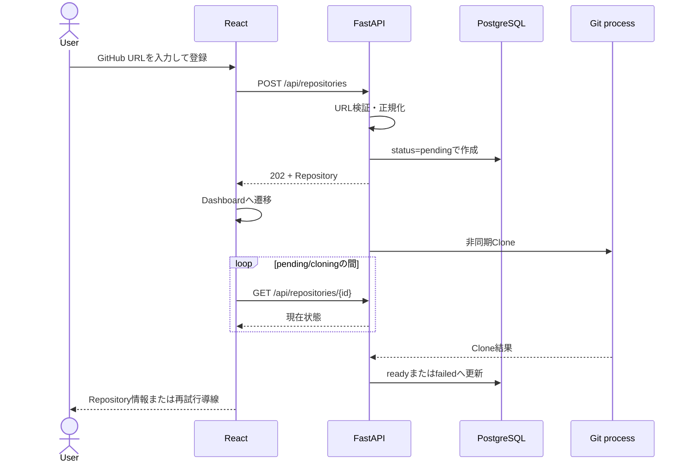
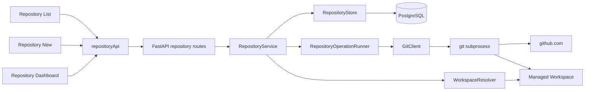
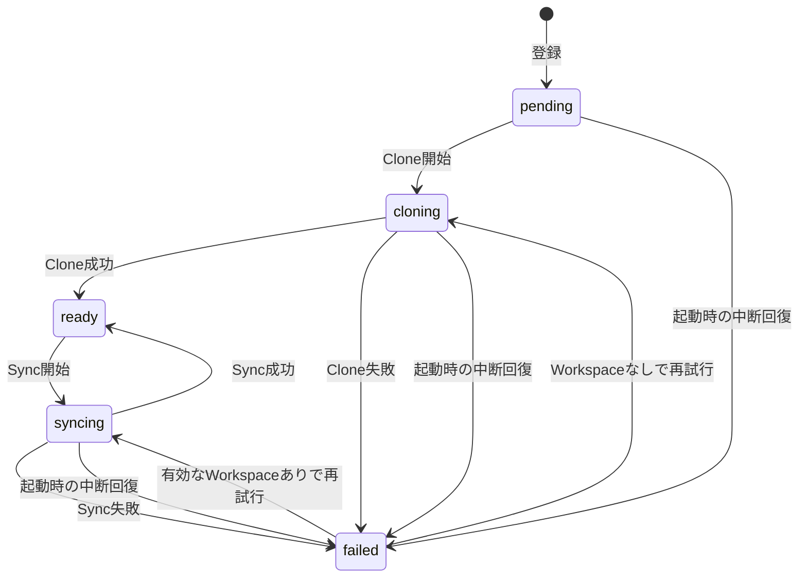

# RepoSpec Viewer Phase 1 詳細設計書

- 文書バージョン: v1.1
- 更新日: 2026-10-08
- ステータス: Phase 1本体は実装済み（Repository削除機能は設計済み・未実装）
- 対象Phase: Phase 1「Repository管理」

本文書は、[概要仕様](./README.md)、[フロントエンド仕様](./frontend-spec.md)、[バックエンド仕様](./backend-spec.md)をPhase 1の実装へ落とし込む詳細設計書である。上位仕様と本文書が矛盾する場合は、Phase 1の範囲に限り本文書を優先する。

今後のPhaseも、実装開始前に`phase-<番号>-detailed-design.md`を作成し、スコープ、状態、API、データ、処理、画面、テスト、完了条件を確定してから実装する。

## 1. 目的とスコープ

### 1.1 目的

Public GitHub RepositoryのURLを登録し、バックエンド管理下のWorkspaceへCloneして、一覧・詳細・最新コード取得・登録解除をWeb画面から操作できる状態にする。

Phase 1完了時には、後続Phaseが次の情報を安全に利用できることを目標とする。

- サーバーが割り当てたRepository ID
- サーバー管理下のWorkspace
- Default Branch
- 最新Commit SHA
- 最終同期日時
- CloneまたはSyncの現在状態と、失敗時の安全なエラー情報
- 不要になったRepositoryの登録情報と管理Workspaceを安全に削除する操作

### 1.2 対象

- GitHub URLの入力、正規化、検証、重複防止
- Public Repositoryの非同期Clone
- Repository一覧、登録、詳細、Sync、削除API
- Repository一覧、登録、Dashboard、削除確認ダイアログ
- PostgreSQLへのRepository情報の保存
- Repository単位の多重実行防止
- タイムアウト、容量、ファイル数、プロセス異常終了の扱い
- Backend、Frontend、Git処理の自動テスト
- `Futaw/GHAgentDev`を使った手動検証手順

### 1.3 対象外

- Private Repositoryの認証、GitHub OAuth、Personal Access Token
- GitHub APIによるRepository情報取得
- Branch選択、Commit選択
- submodule、Git LFS、sparse checkout、shallow clone
- Viewer作成、Viewer件数のDB集計、CodexによるRepository調査
- Clone/Syncの詳細進捗率、SSE、WebSocket
- Redis、Celery、外部Job Queue、複数FastAPI worker
- Repositoryの自動定期Sync

## 2. 上位仕様との対応

| 上位仕様 | Phase 1での実現方法 |
|---|---|
| GitHub URL登録 | `POST /api/repositories` |
| 厳密なURL検証 | バックエンドのURL正規化関数を正式判定とする |
| 管理対象ディレクトリへのClone | Repository ID由来のWorkspaceへ非同期Cloneする |
| 一覧・詳細・同期 | REST APIと3画面で提供する |
| Repository削除 | 確認ダイアログから登録情報と管理Workspaceだけを削除する |
| Branch、Commit SHA、最終同期日時 | Clone/Sync成功時にPostgreSQLへ保存する |
| Repository単位の排他制御 | 状態の条件付き更新とプロセス内Lockを併用する |
| `pending / cloning / ready / syncing / failed`表示 | APIと画面で同じ状態値を使用する |
| Workspaceの安全な管理 | URLやRepository名をディレクトリ名に使わない |

### 2.1 Phase 1で単純化する点

- Clone/SyncはFastAPIプロセス内の`asyncio.Task`で実行する。ジョブ基盤は追加しない。
- 画面は処理中だけRepository一覧または詳細を2秒間隔で再取得する。`sync/events` SSEはPhase 1では実装しない。
- DBテーブルは`repositories`だけを追加する。操作履歴テーブル、イベントテーブルは追加しない。
- FastAPIは1 workerで動かす。複数worker対応は運用形態が変わる段階で設計する。
- 登録フォームはURL 1項目だけなので、Phase 1では新しいFormライブラリを追加しない。
- TypeScript型はPhase 0と同じく明示定義する。OpenAPI型生成はAPI数が増えるPhaseで導入を再判断する。

## 3. ユースケース

### 3.1 Repository登録



### 3.2 最新コード取得

1. ユーザーがRepository Dashboardで「最新コードを取得」を押す。
2. フロントエンドは二重送信を防ぎ、Sync APIを1回呼ぶ。
3. バックエンドは対象Repositoryが処理中でないことを確認する。
4. APIは`202 Accepted`を返し、バックグラウンドでFetchとDefault Branch更新を行う。
5. フロントエンドは`syncing`が終了するまで詳細APIをポーリングする。
6. 成功時はCommit SHAと最終同期日時を更新し、失敗時は直前の成功情報を保持したままエラーを表示する。

### 3.3 失敗後の再試行

- `failed`のRepositoryでも「再試行」を実行できる。
- 有効なGit Workspaceが存在すればSync、存在しなければCloneをやり直す。
- 再試行のために同じURLを再登録させない。

### 3.4 Repository削除

1. ユーザーがRepository Dashboardで`Repositoryを削除`を押す。
2. 画面は、削除対象と影響範囲を示す確認ダイアログを開く。
3. ユーザーが確定すると、フロントエンドは削除APIを1回呼ぶ。
4. バックエンドはClone/Syncなどが実行中でないことと、関連データがないことを確認する。
5. バックエンドは管理Workspaceを削除してからDB行を削除する。
6. 成功時はRepository一覧へ戻り、失敗時はDashboardを維持して再試行できるエラーを表示する。

この操作はRepoSpec Viewer内の登録解除である。GitHub上のRepository、Branch、Commit、Issue、Pull Requestには変更を加えない。

## 4. システム構成



| Component | 責務 |
|---|---|
| Repository routes | HTTP入出力、status code、DTO変換 |
| RepositoryService | 登録、取得、Sync開始、削除、状態遷移、トランザクション境界 |
| RepositoryStore | `repositories`テーブルの読み書きと削除 |
| RepositoryOperationRunner | バックグラウンドTaskと削除を含むRepository単位Lockの管理 |
| GitClient | 引数配列によるGit実行、タイムアウト、結果の正規化 |
| WorkspaceResolver | Repository IDから安全なパスを導出する |
| React pages | 一覧、登録、詳細、状態別表示、操作 |
| TanStack Query | Server state、mutation、処理中の限定ポーリング |

### 4.1 配置方針

現行構成へ次を追加する。実装中に責務が増えない限り、さらに細かい層や抽象クラスは作らない。

```text
backend/
  app/
    api/
      repository_routes.py
      repository_schemas.py
    repositories/
      git.py
      models.py
      service.py
      store.py
      workspace.py
    db.py
  tests/
    unit/
    integration/
alembic/
frontend/src/
  features/repositories/
    RepositoryListPage.tsx
    RepositoryNewPage.tsx
    RepositoryDetailPage.tsx
    repositoryApi.ts
    repositoryTypes.ts
```

## 5. ドメインモデルと状態遷移

### 5.1 Repository

| 項目 | 型 | 必須 | 説明 |
|---|---|---:|---|
| `id` | UUID | Yes | アプリが採番する識別子 |
| `owner` | string | Yes | 入力URLから抽出したowner表示名 |
| `name` | string | Yes | 入力URLから抽出したRepository表示名 |
| `canonical_github_url` | string | Yes | 重複判定に使う小文字化済みHTTPS URL |
| `workspace_key` | string | Yes | UUID文字列。ファイルシステムの子ディレクトリ名 |
| `default_branch` | string | No | Clone成功後に取得するDefault Branch |
| `latest_commit_sha` | string | No | 最後に成功したClone/Sync時の完全なCommit SHA |
| `status` | enum | Yes | `pending / cloning / ready / syncing / failed` |
| `last_synced_at` | datetime | No | 最後にClone/Syncが成功したUTC日時 |
| `last_error_code` | string | No | 最後の失敗を表す公開可能なコード |
| `last_error_message` | string | No | ローカルパス等を含まない利用者向け文言 |
| `created_at` | datetime | Yes | 登録UTC日時 |
| `updated_at` | datetime | Yes | 最終更新UTC日時 |

`viewer_count`はAPI上は常に`0`を返す。Phase 2でViewerテーブルを追加した後に集計値へ置き換え、Repositoryテーブルには保持しない。

### 5.2 状態遷移



状態更新ルール:

- `last_synced_at`と`latest_commit_sha`は成功時だけ更新する。
- 処理開始時に前回の`last_error_*`を消す。
- Sync失敗時も、最後に成功した`default_branch`、`latest_commit_sha`、`last_synced_at`は残す。
- `pending`、`cloning`、`syncing`に対する再度の操作は`REPOSITORY_BUSY`とする。
- 起動時に処理中状態が残っていた場合は`OPERATION_INTERRUPTED`で`failed`へ変更する。

削除専用の状態は追加しない。削除APIは`ready`または`failed`だけを受理し、同一HTTP request内で完了させる。処理中状態では`REPOSITORY_BUSY`を返す。

## 6. データベース設計

PostgreSQL、SQLAlchemy 2系の`AsyncSession`、asyncpgを使用し、schema変更はAlembicで管理する。Phase 1では以下の1テーブルだけを追加する。

```sql
CREATE TABLE repositories (
    id UUID PRIMARY KEY,
    owner VARCHAR(39) NOT NULL,
    name VARCHAR(100) NOT NULL,
    canonical_github_url VARCHAR(255) NOT NULL UNIQUE,
    workspace_key VARCHAR(36) NOT NULL UNIQUE,
    default_branch VARCHAR(255),
    latest_commit_sha VARCHAR(64),
    status VARCHAR(16) NOT NULL,
    last_synced_at TIMESTAMPTZ,
    last_error_code VARCHAR(64),
    last_error_message VARCHAR(500),
    created_at TIMESTAMPTZ NOT NULL,
    updated_at TIMESTAMPTZ NOT NULL,
    CONSTRAINT ck_repositories_status CHECK (
        status IN ('pending', 'cloning', 'ready', 'syncing', 'failed')
    )
);
```

設計ルール:

- 日時はUTCで保存し、APIではISO 8601形式で返す。
- `canonical_github_url`のunique制約を重複防止の最終防衛線とする。
- `workspace_key`は`str(id)`と同じ値をアプリが設定する。
- DB行とWorkspace作成は単一トランザクションにできない。DB行を先に確定し、失敗を状態として保存する。
- DB SessionをGit処理中に保持しない。状態更新ごとに短いトランザクションを使う。
- アプリ起動時にmigrationを自動実行しない。開発・デプロイ手順で`alembic upgrade head`を明示的に実行する。
- Repository削除では既存schemaを変更しない。Phase 2で子テーブルを追加するときは外部キーを`ON DELETE RESTRICT`とし、関連データが残るRepositoryの削除を拒否する。

## 7. GitHub URL検証

### 7.1 受理する形式

```text
https://github.com/{owner}/{repository}
https://github.com/{owner}/{repository}.git
```

先頭・末尾の空白と、URL末尾の1個の`/`は除去してよい。正規化結果は次の形式とする。

```text
https://github.com/{ownerの小文字}/{repositoryの小文字}
```

例:

| 入力 | 結果 |
|---|---|
| `https://github.com/Futaw/GHAgentDev` | `https://github.com/futaw/ghagentdev` |
| `https://github.com/Futaw/GHAgentDev.git` | `https://github.com/futaw/ghagentdev` |
| ` https://github.com/Futaw/GHAgentDev/ ` | `https://github.com/futaw/ghagentdev` |

### 7.2 検証順序

1. 文字数が1〜2,048文字であることを確認する。
2. `urllib.parse.urlsplit`相当で分解する。
3. schemeが`https`、hostnameが`github.com`であることを確認する。
4. userinfo、明示port、query、fragmentがないことを確認する。
5. pathが空でない2セグメントだけであることを確認する。
6. `%`を含むpercent encoding、`.`、`..`、空セグメントを拒否する。
7. ownerは1〜39文字の英数字と`-`、Repository名は1〜100文字の英数字と`.`、`_`、`-`だけを許可する。
8. Repository名末尾の`.git`を1回だけ除去する。
9. canonical URLを作り、DBのunique制約を含めて重複を確認する。

SSH URL、`git://`、`file://`、ローカルパス、`www.github.com`、GitHub以外のhost、Repositoryより深いpathは拒否する。フロントエンドにも同等の軽量チェックを置くが、正式判定はバックエンドとする。

## 8. API設計

APIのJSONキーは`snake_case`、日時はUTC ISO 8601、Commit SHAは省略しない完全値とする。

### 8.1 Repository表現

```json
{
  "id": "8d66ac14-9530-4777-a643-2513bd1c9a38",
  "owner": "Futaw",
  "name": "GHAgentDev",
  "full_name": "Futaw/GHAgentDev",
  "github_url": "https://github.com/futaw/ghagentdev",
  "default_branch": "main",
  "latest_commit_sha": "62e9167c00000000000000000000000000000000",
  "status": "ready",
  "last_synced_at": "2026-09-30T03:00:00Z",
  "last_error": null,
  "viewer_count": 0,
  "created_at": "2026-09-30T02:59:50Z",
  "updated_at": "2026-09-30T03:00:00Z"
}
```

失敗時の`last_error`:

```json
{
  "code": "CLONE_FAILED",
  "message": "Public Repositoryへアクセスできませんでした。URLと公開状態を確認してください。",
  "retryable": true
}
```

APIには`workspace_key`、絶対パス、Git stderrを返さない。

### 8.2 一覧

```http
GET /api/repositories
```

応答は`updated_at`降順とし、初期版ではページングを設けない。

```json
{
  "items": []
}
```

### 8.3 登録

```http
POST /api/repositories
Content-Type: application/json

{
  "github_url": "https://github.com/Futaw/GHAgentDev"
}
```

- DB行作成後に`202 Accepted`を返す。
- `Location: /api/repositories/{id}`と`Retry-After: 2`を付ける。
- 応答bodyは作成したRepository表現とする。
- Clone完了をHTTP request内で待たない。
- 同じcanonical URLが存在する場合は`409 REPOSITORY_ALREADY_REGISTERED`とし、Problem Detailsへ`repository_id`を追加する。

### 8.4 詳細

```http
GET /api/repositories/{repository_id}
```

- 存在すればRepository表現を返す。
- UUID形式不正は`422 VALIDATION_ERROR`、存在しないUUIDは`404 REPOSITORY_NOT_FOUND`とする。

### 8.5 Syncまたは再試行

```http
POST /api/repositories/{repository_id}/sync
```

- `ready`または`failed`だけ受理する。
- 有効なWorkspaceがあればSync、なければCloneを開始する。
- `202 Accepted`、`Location`、`Retry-After: 2`と更新後のRepository表現を返す。
- 処理中の場合は`409 REPOSITORY_BUSY`とする。

### 8.6 削除

```http
DELETE /api/repositories/{repository_id}
```

- Request bodyは受け取らない。
- `ready`または`failed`だけを受理し、Clone/Sync中は`409 REPOSITORY_BUSY`とする。
- 成功時は`204 No Content`を返す。
- 対象が存在しない場合は`404 REPOSITORY_NOT_FOUND`とする。
- 管理Workspaceが存在しない場合もDB行を削除できる。
- Workspace削除に失敗した場合はDB行を残し、`500 DELETE_FAILED`を返す。
- Phase 2以降でViewerなどの関連データが存在する場合は、何も削除せず`409 REPOSITORY_IN_USE`を返す。
- GitHubへのAPI requestやGitコマンドは実行しない。
- 削除完了後は同じGitHub URLを再登録できる。

### 8.7 エラーコード

| HTTP | code | 場面 | retryable |
|---:|---|---|---:|
| 422 | `INVALID_GITHUB_URL` | URL形式が対象外 | No |
| 409 | `REPOSITORY_ALREADY_REGISTERED` | canonical URL重複 | No |
| 404 | `REPOSITORY_NOT_FOUND` | Repository IDなし | No |
| 409 | `REPOSITORY_BUSY` | Clone/Sync中 | Yes |
| 409 | `REPOSITORY_IN_USE` | Viewerなどの関連データが存在 | No |
| 500 | `DELETE_FAILED` | 管理Workspaceを安全に削除できない | Yes |
| 503 | `DATABASE_UNAVAILABLE` | DB接続不能 | Yes |

非同期処理中の`CLONE_FAILED`、`SYNC_FAILED`、`REPOSITORY_TOO_LARGE`、`OPERATION_INTERRUPTED`はHTTP応答ではなく、Repositoryの`status`と`last_error`へ保存する。

## 9. バックエンド処理設計

### 9.1 登録処理

1. URLを検証・正規化する。
2. UUIDを採番し、`workspace_key = str(id)`とする。
3. `pending`でDBへinsertする。
4. commit後にClone Taskを作成する。
5. Taskは状態を`cloning`へ条件付き更新する。
6. staging directoryへCloneする。
7. 容量、ファイル数、Git metadataを検証する。
8. staging directoryを確定Workspaceへ同一ファイルシステム上でrenameする。
9. `ready`、Default Branch、Commit SHA、成功日時を保存する。
10. 失敗時はstaging directoryを片付け、サニタイズ済みエラーと`failed`を保存する。

Task作成自体に失敗した場合も、API処理内で`failed / OPERATION_INTERRUPTED`へ更新する。DB commit前にはTaskを開始しない。

### 9.2 Sync処理

1. DB上の状態を条件付き更新し、二重開始を防ぐ。
2. Workspace pathが管理ルート直下かつ想定UUID名であることを再検証する。
3. `.git`の存在と`origin` URLが登録URLに対応することを確認する。
4. `git fetch`を行う。
5. `origin/HEAD`を更新し、Default Branchを取得する。
6. Working Treeを`refs/remotes/origin/{default_branch}`へ合わせる。
7. 容量、ファイル数、Commit SHAを検証する。
8. 成功情報をDBへ保存する。

Sync途中で失敗しても最後の成功metadataは上書きしない。Working Tree更新前のFetchで失敗した場合は既存Working Treeを維持する。

### 9.3 Gitコマンド

Gitはshell文字列ではなく引数配列で実行する。概念上のコマンドは次のとおりである。

```text
git -c credential.helper= -c core.hooksPath=<empty-hooks> -c protocol.file.allow=never -c http.followRedirects=false clone --no-tags --origin origin -- <url> <staging>
git -C <workspace> -c credential.helper= -c core.hooksPath=<empty-hooks> -c protocol.file.allow=never -c http.followRedirects=false fetch --no-tags origin
git -C <workspace> -c credential.helper= -c core.hooksPath=<empty-hooks> -c protocol.file.allow=never -c http.followRedirects=false remote set-head origin -a
git -C <workspace> symbolic-ref --short refs/remotes/origin/HEAD
git -C <workspace> reset --hard refs/remotes/origin/<default-branch>
git -C <workspace> -c core.hooksPath=<empty-hooks> clean -ffdx
git -C <workspace> rev-parse HEAD
git -C <workspace> ls-files -z
```

実装上のルール:

- `asyncio.create_subprocess_exec`を使用し、`shell=True`を使わない。
- URL、Workspace、refをログ用文字列へ連結して再実行しない。
- `GIT_TERMINAL_PROMPT=0`、空のcredential helper、空のhooks pathを指定する。
- `GIT_CONFIG_GLOBAL`と`GIT_CONFIG_SYSTEM`を空の管理ファイルへ向け、global/system configによるURL書き換えやcredential設定を継承しない。
- HTTP redirectとfile protocolを無効化する。
- GitHub CLIや開発者PCの認証情報をGit subprocessへ渡さない。
- stdout、stderrに上限を設ける。利用者にはサニタイズ済みメッセージだけを返す。
- timeout時はterminateし、終了しなければkillする。
- Repository内容のhookは実行しない。
- full cloneを使用する。後続Phaseが過去の生成Commitを参照するため、`--depth`は使用しない。

### 9.4 Workspace

```text
<WORKSPACE_ROOT>/
  repositories/
    <repository-uuid>/
  staging/
    <operation-uuid>/
  empty-hooks/
```

- `WORKSPACE_ROOT`は起動時に絶対パスへ解決する。
- 確定Workspaceの子名は`workspace_key`だけから作る。
- owner、Repository名、URL、ユーザー入力をpathへ使用しない。
- pathを使用するたびに`resolve`結果が管理ルート配下であることを確認する。
- stagingの削除対象は、サーバーが生成したoperation UUIDの直下だけに限定する。
- Repository削除対象は、DBの`workspace_key`から解決した`repositories/<repository-uuid>`直下だけに限定する。
- 削除対象がsymlink、または通常のディレクトリ以外である場合は削除を中止する。
- Repository内symlinkを辿って容量を集計しない。
- `.git`を含むWorkspace全体の容量と、`git ls-files`による追跡ファイル数を検査する。

### 9.5 排他とTask管理

- `RepositoryOperationRunner`がRepository ID単位の`asyncio.Lock`とTaskを保持する。
- DBの状態更新は対象状態をWHERE条件へ含め、同一操作の開始を原子的に拒否する。
- 異なるRepositoryの操作は並行実行してよい。
- アプリ停止時は新規操作を受け付けず、実行中Taskをキャンセルする。
- 起動時に残った`pending / cloning / syncing`は`failed / OPERATION_INTERRUPTED`へ回復する。
- 複数workerではLockを共有できないため、Phase 1の起動方法は1 workerに固定する。
- 削除処理は同じRepository IDのTaskがないことを確認してから、同じLockをHTTP requestの完了まで保持する。

### 9.6 削除処理

1. Repositoryを取得し、存在しなければ`REPOSITORY_NOT_FOUND`とする。
2. 状態が`ready`または`failed`であることを確認する。
3. `RepositoryOperationRunner`で同じRepositoryのTaskがないことを確認し、Repository単位Lockを取得する。
4. Lock取得後にRepositoryと状態を再取得し、競合がないことを確認する。
5. Phase 2以降の関連データが存在する場合は`REPOSITORY_IN_USE`として終了する。
6. `workspace_key`から削除対象を解決し、管理ルート直下のUUID directoryであることを再検証する。
7. Workspaceが存在する場合は`asyncio.to_thread`で`shutil.rmtree`を実行する。存在しない場合は成功として続行する。
8. Workspace削除成功後に`repositories`のDB行を削除する。
9. Lockを解放し、`204 No Content`を返す。

Workspace削除が失敗した場合はDB行を削除しない。DB行削除が失敗した場合は、Workspaceが存在しない状態でDB行を残し、`DATABASE_UNAVAILABLE`を返す。いずれの場合もDB行が残るため同じURLを再登録せず、Dashboardから削除を再試行する。

次のログを同じ`trace_id`と`repository_id`で別々に記録する。

- `repository.workspace_delete_started / completed / failed`
- `repository.record_delete_started / completed / failed`

GitHub上のRepositoryを変更する処理は含めない。

## 10. フロントエンド設計

### 10.1 Route

| Route | Page | 主な操作 |
|---|---|---|
| `/repositories` | Repository一覧 | 一覧表示、登録画面、詳細画面への遷移 |
| `/repositories/new` | Repository登録 | URL検証、登録 |
| `/repositories/:repositoryId` | Repository Dashboard | 状態表示、Sync、再試行、削除 |

3 Routeは既存の`RequireAuth`配下へ追加する。Phase 0の`/chat`は残し、HeaderからChatとRepositoriesを移動できるようにする。

### 10.2 Repository一覧

- `full_name`、GitHub URL、Default Branch、短縮Commit SHA、最終同期日時、状態を表示する。
- Commit SHAは先頭7文字を表示するが、title属性または詳細画面で完全値を確認できるようにする。
- Repositoryが0件の場合は登録導線を含むempty stateを表示する。
- `pending / cloning / syncing`が1件でもある間だけ2秒間隔で一覧を再取得する。
- `failed`はエラー文言と詳細画面への導線を表示する。

### 10.3 Repository登録

- URLは必須、最大2,048文字とする。
- クライアント検証失敗は入力欄の直下に表示する。
- 送信中は入力欄と登録ボタンを無効化する。
- `202`受信後は`/repositories/{id}`へ遷移する。
- `REPOSITORY_ALREADY_REGISTERED`はエラー表示と既存Repositoryを開く導線を出す。
- POSTは自動再試行しない。

### 10.4 Repository Dashboard

- Repository名、GitHubリンク、状態、Default Branch、Commit SHA、最終同期日時を表示する。
- `ready`では「最新コードを取得」を有効にする。
- `failed`では「再試行」を有効にし、`last_error`を表示する。
- 処理中は操作を無効化し、状態が終了するまで2秒間隔で詳細を再取得する。
- 危険操作領域に`Repositoryを削除`を表示し、処理中または`viewer_count > 0`では無効化して理由を表示する。
- Phase 2の「Viewerを作成」は無効状態で「Phase 2で利用可能」と表示する。
- Viewer一覧領域は「Viewerはまだありません」のplaceholderだけを表示する。

### 10.5 Query設計

| 用途 | Query key / mutation |
|---|---|
| 一覧 | `['repositories']` |
| 詳細 | `['repositories', repositoryId]` |
| 登録 | `createRepository` mutation |
| Sync | `syncRepository` mutation |
| 削除 | `deleteRepository` mutation |

mutation成功時は関連queryへ応答値を設定してからinvalidateする。ポーリングは処理中状態だけで有効にし、画面を離れた後は停止する。

### 10.6 エラー表示

| code | UI |
|---|---|
| `INVALID_GITHUB_URL` | URL入力欄の直下 |
| `REPOSITORY_ALREADY_REGISTERED` | 既存Repositoryへのリンク付きnotice |
| `REPOSITORY_BUSY` | 現在状態を再取得して処理中表示を継続 |
| `REPOSITORY_IN_USE` | 関連するViewer等を先に削除するよう案内 |
| `REPOSITORY_NOT_FOUND` | 一覧へ戻る導線付きnot found |
| `DELETE_FAILED` | Dashboardと確認ダイアログを維持し、再試行を案内 |
| `DATABASE_UNAVAILABLE`、通信失敗 | ページ内エラーと再試行ボタン |
| 非同期処理の`last_error` | Dashboardの状態card内 |

状態は色だけでなく文字とアイコンで区別し、処理中表示には`aria-live="polite"`を使用する。

### 10.7 Repository削除ダイアログ

- タイトルは`Repositoryを削除しますか？`とする。
- 対象の`full_name`を表示する。
- 「RepoSpec Viewerの登録情報とローカルWorkspaceを削除します。GitHub上のRepositoryは削除されません。」と明記する。
- `キャンセル`を既定のfocus先とし、`削除する`をdanger styleで表示する。
- 削除request中は両ボタンを無効化し、二重送信を防ぐ。
- 成功時はRepository詳細queryを削除し、一覧queryをinvalidateして`/repositories`へ遷移する。
- 失敗時はダイアログを閉じず、Problem Detailsに対応したエラーを表示する。

## 11. 設定

| 環境変数 | 初期値 | 用途 |
|---|---|---|
| `DATABASE_URL` | 必須 | PostgreSQL接続先 |
| `WORKSPACE_ROOT` | `.data/workspaces` | 管理Workspace root |
| `GIT_EXECUTABLE` | `git` | Git実行ファイル |
| `GIT_CLONE_TIMEOUT_SECONDS` | `300` | Clone timeout |
| `GIT_SYNC_TIMEOUT_SECONDS` | `120` | Sync timeout |
| `GIT_MAX_REPOSITORY_BYTES` | `1073741824` | `.git`込み1 GiB上限 |
| `GIT_MAX_FILE_COUNT` | `100000` | 追跡ファイル数上限 |

数値は正の値だけを受け付ける。`WORKSPACE_ROOT`が通常ファイルまたはsymlinkである場合は起動に失敗させる。秘密情報は新しい設定に含めない。

## 12. セキュリティとエラー処理

### 12.1 Public Repository限定

- GitHub CLI、Keychain、global Git configのcredential helperを使用しない。
- Private Repositoryと存在しないRepositoryは利用者向けには区別せず、`CLONE_FAILED`とする。
- 認証情報を入力するUIやAPIを作らない。
- Gitが認証を要求しても対話入力せず失敗させる。

### 12.2 SSRF・任意ファイルアクセス対策

- 接続先hostを`github.com`に固定する。
- URLのuserinfo、port、redirect先を信用しない。
- Gitのfile protocolを許可しない。
- Workspace pathはアプリ採番UUIDだけから生成する。
- 削除、rename、Git実行前に管理ルート配下であることを再確認する。

### 12.3 ログ

記録してよい項目:

- `trace_id`、`repository_id`
- 操作種別、状態、所要時間、終了コード
- サニタイズ済みerror code

記録しない項目:

- credential、環境変数全体
- Git stderr全文
- 利用者へ不要なローカル絶対パス

## 13. テスト設計

### 13.1 Backend Unit

- URL受理・拒否・正規化のtable-driven test
- 大文字、`.git`、末尾slashを含むURLの重複判定
- Workspaceが管理ルート外へ出ないこと
- 状態遷移、busy判定、成功情報保持
- GitClientがshellを使わず、timeoutと非zero exitを変換すること
- Git stderrと絶対パスが公開エラーへ漏れないこと
- 容量、ファイル数上限
- Repository削除対象のUUID、管理ルート、symlink検証
- 削除中のRepository単位Lockと二重操作拒否

### 13.2 Backend Integration

- PostgreSQL migrationとRepository CRUD
- 同一canonical URLの同時登録が1件だけ成功すること
- ローカルに作成したbare Git RepositoryをGitClientのtest seamからClone/Syncすること
- stagingから確定Workspaceへのrename
- Clone失敗、Sync失敗、timeout、起動時中断回復
- APIのstatus code、Problem Details、処理中状態のポーリング
- `ready`と`failed`のRepository削除成功、Workspaceなしの削除成功
- Clone/Sync中の削除拒否、Workspace削除失敗時のDB行保持
- Workspace削除後にDB削除が失敗した場合の再試行
- 削除後に同じGitHub URLを再登録できること

Public URL validatorは別に検証し、ローカルGit Repositoryを通すtest seamは本番APIから呼べない構造にする。自動テストを外部GitHubの可用性へ依存させない。

### 13.3 Frontend

- 0件、ready、処理中、failedを含む一覧表示
- URL入力の必須・形式エラー
- 登録中の二重送信防止と成功後の遷移
- 重複登録時の既存Repository導線
- 処理中だけポーリングし、readyまたはfailedで停止すること
- Syncボタンと再試行ボタンの状態制御
- API失敗後も画面から再試行できること
- Repository削除ダイアログの表示、キャンセル、二重送信防止
- 削除成功後の一覧遷移とcache更新、失敗時のDashboard維持

### 13.4 手動検証: GHAgentDev

検証URL:

```text
https://github.com/Futaw/GHAgentDev
```

2026-09-30時点で`Futaw/GHAgentDev`はPrivate Repositoryである。Phase 1はPublic Repository限定であり、開発者PCのGitHub認証を流用してPrivate Repositoryを成功させてはならない。

そのため手動検証は次の2段階とする。

1. Privateのまま登録し、認証情報を要求せず`failed / CLONE_FAILED`となることを確認する。
2. ユーザーがRepositoryをPublicへ変更した場合に限り、同じ登録行の「再試行」からCloneを成功させる。

成功時は以下を確認する。

- `full_name`が`Futaw/GHAgentDev`として表示される。
- Default Branchが`main`である。
- Commit SHAがGitHub上の`main`先頭Commitと一致する。
- 同じURLを`.git`付きや大文字小文字違いで再登録できない。
- 新しいCommitのPush後にSyncするとSHAと最終同期日時が更新される。
- Clone/Sync中の二重操作が拒否される。

Repositoryの公開状態変更は本実装や自動テストから行わない。

## 14. 実装順序

1. PostgreSQL接続、SQLAlchemy model、Alembic migration、設定を追加する。
2. URL validator、RepositoryStore、API DTO、一覧・詳細・登録・Sync開始を実装する。
3. WorkspaceResolver、GitClient、OperationRunner、状態回復を実装する。
4. Repository 3画面、Route、query、mutation、ポーリングを実装する。
5. 自動テストとGHAgentDev手動検証を行い、READMEと本書の確認結果を更新する。

実装はこの順序で進めるが、Phase 1を完了していない途中状態を`main`へ直接入れない。Pull Requestの差分とテスト結果をユーザーが確認し、承認後にユーザーがmergeする。

### 14.1 Repository削除機能の追加実装順序

1. WorkspaceResolver、RepositoryStore、RepositoryOperationRunnerへ削除処理を追加する。
2. RepositoryServiceと`DELETE /api/repositories/{repository_id}`を追加する。
3. Repository Dashboardへ削除確認ダイアログとmutationを追加する。
4. Backend、Frontendの削除テストと実ブラウザ確認を行う。

削除機能はPhase 1本体の実装後に追加された仕様であり、既存の登録・Clone・Sync契約を変更しない。

## 15. 完了条件

1. Public GitHub URLだけを受け付け、危険または曖昧なURLを拒否できる。
2. 登録APIが即時に応答し、Clone状態を一覧と詳細から確認できる。
3. Clone成功後にDefault Branch、Commit SHA、最終同期日時が保存される。
4. 一覧、登録、Dashboardの3画面が認証済みRouteで利用できる。
5. Sync成功後に最新Commitへ更新される。
6. 同一RepositoryのClone/Syncが同時実行されない。
7. 失敗してもAPIや画面に認証情報、Git stderr全文、絶対パスが漏れない。
8. Private Repositoryをambient credentialでCloneしない。
9. プロセス再起動後に処理中状態が`failed`へ回復する。
10. BackendとFrontendの自動テスト、lint、buildが成功する。
11. GHAgentDevを使った検証結果と、公開状態による制約が記録される。
12. `ready`または`failed`のRepositoryを確認後に削除できる。
13. 削除によりアプリのDB行と管理Workspaceだけがなくなり、GitHub上のRepositoryは変更されない。
14. Clone/Sync中や関連データが存在するRepositoryの削除が拒否される。
15. Workspace削除に失敗した場合はDB行が残り、削除を再試行できる。
16. 削除完了後に同じGitHub URLを再登録できる。

## 16. Phase 2への引き継ぎ

Phase 2は`status = ready`のRepositoryだけをViewer生成対象にする。Generation開始時に`latest_commit_sha`を確定し、Workspaceの現在値だけに依存しない設計を追加する。

Phase 2でViewerを古いCommitへ固定した後もソースを参照できるよう、必要なCommitをGit refで保持する方式はPhase 2詳細設計で決定する。Phase 1ではfull cloneとし、自動`git gc`は実行しない。

Phase 2でViewer等の子テーブルを追加するときはRepository外部キーを`ON DELETE RESTRICT`とし、関連データが残るRepository削除を`REPOSITORY_IN_USE`で拒否する。子データを連鎖削除する仕様は設けない。

## 17. 実装確認結果（2026-10-01）

この節の確認結果は登録・Clone・一覧・詳細・Syncを対象とする。2026-10-08に追加したRepository削除機能は未実装であり、以下の結果には含まれない。

- Backend: Ruff check / format check 成功、Pytest 28件成功
- Frontend: Vitest 6件成功、ESLint成功、TypeScript + Vite production build成功
- 実ブラウザ: 一覧empty state、登録必須エラー、登録後Dashboard遷移、Private Repositoryの失敗表示、Desktop/Mobileレイアウトを確認。console error / warningなし
- Alembic: PostgreSQL dialectによる`upgrade head --sql`生成成功
- Git結合テスト: ローカルbare Repositoryのfull clone、追加Commitのfetch/reset成功
- API結合テスト: 登録`202`、重複`409`、不正URL`422`、存在しないID`404`、非同期Clone失敗の保存を確認
- GitHub手動検証: ambient credential、global/system Git config、対話入力を無効化した`git ls-remote`は、`Futaw/GHAgentDev`に対して認証要求を出さず失敗した。Private Repositoryを開発者PCの認証で取得しないことを確認した

開発環境にはPostgreSQL実行ファイルがないため、実DatabaseへのMigration適用は未実施である。Migration SQLとRepository CRUDは、それぞれPostgreSQL dialectのoffline生成とSQLite結合テストで検証した。
