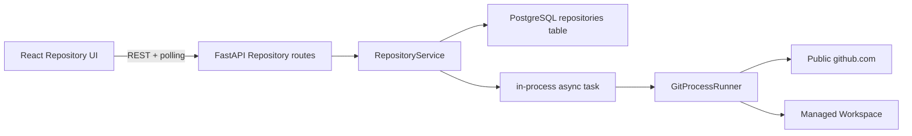
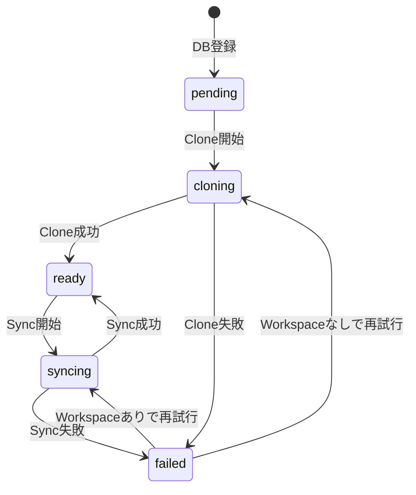

# RepoSpec Viewer Phase 1 詳細仕様

- 文書バージョン: v1.0
- 作成日: 2026-09-07
- 対象: Public GitHub Repositoryの登録・Clone・一覧・詳細・Sync
- ステータス: 仕様確定

本文書は、概要仕様にあるPhase 1を、1つずつレビュー・マージできる小さなPull Requestへ分割するための実装仕様である。Phase 0のCodex接続と最小チャットは変更せず、Repository管理だけを追加する。

## 1. チェックリストの使い分け

本文書では、仕様作成と将来の実装を混同しないために2種類のチェックリストを使う。

- `仕様作成チェック`: 本文書内で対象機能の仕様が決まった時点で`[x]`にする。
- `実装完了条件`: 対応Pull Requestで実装・テストが終わるまで`[ ]`のままにする。

### 1.1 仕様作成チェック

- [x] P1-01 GitHub URL検証
- [x] P1-02 Repository永続化基盤
- [x] P1-03 管理WorkspaceとGit実行基盤
- [x] P1-04 Repository登録とClone
- [x] P1-05 Repository一覧・詳細API
- [x] P1-06 Repository同期
- [x] P1-07 Frontend共通導線とAPI型
- [x] P1-08 Repository登録画面
- [x] P1-09 Repository一覧画面
- [x] P1-10 Repository Dashboardと同期UI

### 1.2 実装進捗

- [ ] P1-01 GitHub URL検証を実装
- [ ] P1-02 Repository永続化基盤を実装
- [ ] P1-03 管理WorkspaceとGit実行基盤を実装
- [ ] P1-04 Repository登録とCloneを実装
- [ ] P1-05 Repository一覧・詳細APIを実装
- [ ] P1-06 Repository同期を実装
- [ ] P1-07 Frontend共通導線とAPI型を実装
- [ ] P1-08 Repository登録画面を実装
- [ ] P1-09 Repository一覧画面を実装
- [ ] P1-10 Repository Dashboardと同期UIを実装

## 2. Phase 1の目的

ユーザーがPublic GitHub RepositoryのURLを登録し、アプリ管理下のWorkspaceへCloneした後、Repository情報の確認と最新コードへの同期を行えるようにする。

Phase 1完了時の利用フローは次のとおりとする。

```text
Repository一覧
  ↓ 新規登録
GitHub URL入力
  ↓ 202 Accepted
Repository Dashboard（cloning）
  ↓ 自動ポーリング
Repository Dashboard（ready）
  ↓ 最新コードを取得
Repository Dashboard（syncing → ready）
```

### 2.1 Phase 1全体の完了条件

- [ ] Public GitHub Repository URLを1件登録できる。
- [ ] 登録されたRepositoryがサーバー管理WorkspaceへCloneされる。
- [ ] Clone中、完了、失敗を画面で判別できる。
- [ ] Repository一覧と詳細をブラウザから確認できる。
- [ ] Default Branch、Commit SHA、最終同期日時を確認できる。
- [ ] 「最新コードを取得」でDefault Branchの最新Commitへ同期できる。
- [ ] 同一Repositoryに対するCloneとSyncが同時実行されない。
- [ ] 不正URL、Private Repository、Git失敗が安全なエラーとして表示される。
- [ ] Repositoryのユーザー入力が任意コマンドや任意パスとして解釈されない。
- [ ] Phase 0のログインと最小チャットが引き続き動作する。

## 3. スコープ

### 3.1 Phase 1で実装するもの

- Public GitHub Repository URLの入力と厳密な検証
- PostgreSQLとAlembicによるRepository情報の永続化
- サーバーが決定したWorkspaceへのClone
- Repository一覧API・詳細API
- Default Branch、Commit SHA、最終同期日時の取得
- Default Branchの最新CommitへのSync
- Repository単位の排他制御
- Clone/Sync状態のポーリング表示
- Clone/Sync失敗時の再試行
- Repository一覧、登録、Dashboardの3画面

### 3.2 Phase 1で実装しないもの

- Private Repository、GitHub OAuth、Personal Access Token
- Repository削除、名称変更、手動Branch選択
- Pull Request、Issue、Commit履歴の表示
- submoduleとGit LFSの取得
- 複数Repositoryの一括登録・一括同期
- Redis、Celery、外部Job Queue、複数worker対応
- Clone/Sync操作履歴専用テーブル
- Clone/SyncのSSE配信とキャンセルAPI
- Viewer生成、Viewer件数の実集計、ソースコード表示
- 容量の事前見積もりやGitHub APIによるRepositoryメタデータ取得

Phase 1はローカル・単一ユーザー・FastAPI 1プロセスを前提とする。状態変化はTanStack Queryのポーリングで取得し、SSEや分散ロックは必要になったPhaseで追加する。

## 4. 最小アーキテクチャ



責務の境界は次のとおりとする。

| 層 | 責務 |
|---|---|
| API Route | HTTP入出力、status code、DTO変換 |
| RepositoryService | 状態遷移、重複判定、排他、Task開始 |
| RepositoryStore | SQLAlchemyによるRepository行の読み書き |
| GitHubUrlValidator | URLの検証と正規化 |
| WorkspaceManager | Workspace pathの生成と境界検証 |
| GitProcessRunner | shellを使わないGit子プロセス実行、timeout、結果取得 |
| Frontend | 入力、一覧、詳細、状態ポーリング、再試行 |

## 5. 設計判断

| 項目 | Phase 1の判断 | 理由 |
|---|---|---|
| Database | PostgreSQL + SQLAlchemy 2.x async + asyncpg + Alembic | 既存の技術方針に沿い、Phase 2以降も利用できるため |
| 非同期処理 | FastAPIプロセス内の`asyncio.Task` | ローカル単一ユーザーでは外部Queueが不要なため |
| 進捗取得 | 2秒間隔のRESTポーリング | Clone/Syncは詳細な逐次表示を必要とせず、SSE追加を避けるため |
| Clone対象 | Default Branchのみ | Phase 2の解析に必要なworking treeを最小構成で得るため |
| GitHub連携 | Git CLIのみ | GitHub API、OAuth、追加token管理を導入しないため |
| Repository削除 | Phase 1対象外 | DBとファイル削除の安全設計を別PRで扱うため |
| 排他制御 | DBの状態更新 + プロセス内Lock | 1プロセス前提で十分なため |
| API型 | Backend DTOと手書きのTypeScript型 | Phase 1の小規模契約では型生成基盤を先に作らないため |
| Viewer数 | 常に`0`を返す | Viewerテーブルがまだ存在しないため |

## 6. Repositoryデータモデル

Phase 1では`repositories`テーブルだけを追加する。Clone/Sync専用のJobテーブルは作らない。

| Column | PostgreSQL型 | Null | 制約・用途 |
|---|---|---:|---|
| `id` | UUID | No | Primary Key、アプリが生成 |
| `owner` | VARCHAR(100) | No | 正規化後のGitHub owner |
| `name` | VARCHAR(100) | No | `.git`を除いたRepository名 |
| `canonical_github_url` | VARCHAR(512) | No | Unique、`https://github.com/{owner}/{name}` |
| `default_branch` | VARCHAR(255) | Yes | Clone成功後に設定 |
| `latest_commit_sha` | VARCHAR(64) | Yes | `git rev-parse HEAD`の結果 |
| `status` | VARCHAR(16) | No | `pending/cloning/ready/syncing/failed` |
| `last_synced_at` | TIMESTAMPTZ | Yes | CloneまたはSync成功時刻 |
| `last_error_code` | VARCHAR(64) | Yes | UIへ公開可能なエラーコード |
| `last_error_message` | VARCHAR(500) | Yes | サニタイズ済みユーザー向け文言 |
| `created_at` | TIMESTAMPTZ | No | UTC |
| `updated_at` | TIMESTAMPTZ | No | UTC、状態変更時に更新 |

`status`にはCHECK constraintを設定する。PostgreSQL固有ENUMは、値追加時のmigrationを簡単にするためPhase 1では使わない。

### 6.1 Repository状態遷移



状態遷移の原則:

- `pending`、`cloning`、`syncing`のRepositoryへ新しい操作を要求した場合は`409 REPOSITORY_BUSY`を返す。
- Clone/Sync開始時に以前の`last_error_*`をクリアする。
- Sync失敗時も、最後に成功した`latest_commit_sha`と`last_synced_at`は保持する。
- Backend起動時に`pending`、`cloning`、`syncing`のまま残った行は`failed`へ変更し、`OPERATION_INTERRUPTED`を設定する。
- `failed`からの再試行は`POST /sync`を使う。管理WorkspaceがなければCloneをやり直す。

## 7. GitHub URL検証

入力値はPydantic DTOで文字列長を検証した後、`urllib.parse.urlsplit`を使って構造を検証する。正規表現だけでURL全体を判定しない。

### 7.1 受理条件

- 前後の空白を除去した長さが1〜512文字
- schemeは`https`
- hostnameは大文字小文字を無視して`github.com`と完全一致
- userinfo、password、明示portがない
- pathは`/{owner}/{repository}`または末尾に`/`が付く形
- path segmentはちょうど2つ
- ownerとrepositoryはASCII英数字、`.`、`_`、`-`だけ
- repository末尾の`.git`は1回だけ除去する
- ownerとrepositoryは`.`または`..`ではない
- queryとfragmentがない
- percent encoding、制御文字、backslashがない

### 7.2 正規化

- hostnameを`github.com`へ統一する。
- ownerとrepositoryを小文字へ変換する。
- `.git`と末尾slashを除去する。
- `https://github.com/{owner}/{repository}`形式を正本とする。

GitHub上の表示上の大文字小文字はPhase 1では保持しない。重複判定を安定させることを優先する。

### 7.3 例

| 入力 | 結果 |
|---|---|
| `https://github.com/openai/codex` | 受理 |
| `https://github.com/OpenAI/Codex.git` | `https://github.com/openai/codex`へ正規化 |
| `https://github.com/openai/codex/` | 末尾slashを除去して受理 |
| `http://github.com/openai/codex` | `INVALID_GITHUB_URL` |
| `https://gitlab.com/openai/codex` | `INVALID_GITHUB_URL` |
| `git@github.com:openai/codex.git` | `INVALID_GITHUB_URL` |
| `https://user@github.com/openai/codex` | `INVALID_GITHUB_URL` |
| `https://github.com:443/openai/codex` | `INVALID_GITHUB_URL` |
| `https://github.com/openai/codex?tab=readme` | `INVALID_GITHUB_URL` |
| `file:///tmp/repository` | `INVALID_GITHUB_URL` |

URL形式が正しくても、Repositoryの存在とPublicかどうかはClone結果で判定する。Private Repositoryと存在しないRepositoryは、認証情報を使わないCloneが失敗した結果として`REPOSITORY_NOT_FOUND_OR_PRIVATE`へ正規化する。

## 8. 管理Workspace

### 8.1 path規則

- `WORKSPACE_ROOT`はBackend設定から取得し、起動時に絶対pathへ正規化する。
- Repositoryの保存先は`{WORKSPACE_ROOT}/{repository_id}`とする。
- `repository_id`はサーバー生成UUIDであり、owner、repository名、URLをpathへ使用しない。
- Clone中の一時pathは`{WORKSPACE_ROOT}/.tmp-{repository_id}`とする。
- Workspace root自体がsymlinkの場合は起動時に実体pathへ解決し、それを境界判定の正本とする。
- 操作前後に対象pathを解決し、Workspace rootの外へ出る場合は処理を拒否する。
- 既存の同名path、symlink、Git Repositoryではないpathを上書きしない。

### 8.2 Cloneの原子性

1. 一時pathが存在しないことを確認する。
2. 一時pathへCloneする。
3. Clone結果、Default Branch、Commit SHA、容量・ファイル数を検証する。
4. 最終pathが存在しないことを再確認する。
5. 同一filesystem上のrenameで一時pathを最終pathへ移す。
6. DBを`ready`へ更新する。

失敗した一時pathは、対象がWorkspace root直下の期待した`.tmp-{repository_id}`であることを再検証してから削除する。最終WorkspaceはClone再試行のために自動削除しない。

## 9. Git実行契約

Gitコマンドは`asyncio.create_subprocess_exec`へ引数配列を渡し、`shell=True`や組み立てたshell文字列を使用しない。

### 9.1 共通制約

- 実行ファイルは`GIT_EXECUTABLE`設定から取得する。
- `GIT_TERMINAL_PROMPT=0`を設定し、対話入力を禁止する。
- `credential.helper`を無効化し、ローカルに保存されたGitHub認証を使用しない。
- `core.hooksPath`を無効な固定pathへ設定し、hookを実行しない。
- GitHub token、SSH agent、ユーザー入力由来の環境変数を渡さない。
- stdout/stderrは上限付きで読み、APIへ生のstderrを返さない。
- timeout時は子プロセスを終了し、`GIT_TIMEOUT`へ変換する。
- ログにはRepository ID、処理名、終了code、所要時間を記録し、認証情報は記録しない。

### 9.2 Clone

概念上、次の引数配列に相当する処理を実行する。

```text
git
  -c credential.helper=
  -c core.hooksPath=/dev/null
  clone
  --single-branch
  --no-tags
  --origin origin
  {canonical_github_url}
  {temporary_workspace_path}
```

Phase 2以降で過去Commitを参照できるよう、Phase 1ではshallow cloneにしない。submoduleの初期化とGit LFS pullは実行しない。

Clone後に次を取得する。

- Default Branch: `refs/remotes/origin/HEAD`を優先し、取得できない場合は現在branchを使用
- Commit SHA: `git rev-parse HEAD`
- origin URL: `git remote get-url origin`を再正規化し、登録URLと一致することを確認

### 9.3 Sync

1. Workspaceが管理root内にあり、通常ディレクトリかつGit Repositoryであることを確認する。
2. `origin` URLが登録済みcanonical URLと一致することを確認する。
3. working treeに変更がある場合は`WORKSPACE_DIRTY`で失敗させ、自動削除・自動resetしない。
4. `git fetch --prune --no-tags origin`を実行する。
5. `origin/HEAD`からDefault Branchを再取得する。
6. Default Branchを`refs/remotes/origin/{branch}`へfast-forwardする。
7. Commit SHAと成功時刻をDBへ保存する。

アプリ自身が管理するWorkspaceであっても、予期しないファイルを`git clean`で削除しない。破壊的な修復はPhase 1の自動処理に含めない。

### 9.4 上限の初期値

| 設定 | 初期値 |
|---|---:|
| `GIT_CLONE_TIMEOUT_SECONDS` | 600秒 |
| `GIT_SYNC_TIMEOUT_SECONDS` | 300秒 |
| `GIT_MAX_REPOSITORY_BYTES` | 2 GiB |
| `GIT_MAX_FILE_COUNT` | 100,000 |
| `GIT_OUTPUT_LIMIT_BYTES` | 64 KiB |

容量とファイル数はClone完了後に検証する。上限超過時は一時Workspaceを安全に削除し、Repositoryを`failed`にする。Clone前の容量見積もりは行わない。

## 10. 非同期処理と排他

- Repository登録APIはDBへ`pending`を保存した後、Clone Taskを開始して`202 Accepted`を返す。
- Clone/Sync TaskはFastAPIと同じevent loopで管理する。
- `RepositoryTaskRegistry`はRepository IDごとに最大1 Taskと1 Lockを持つ。
- DBのstatusを条件付き更新し、`pending/ready/failed`からだけ実行状態へ遷移できるようにする。
- 同じRepositoryに2つ目の操作が来た場合は`409 REPOSITORY_BUSY`を返す。
- Backend停止時は新規Task受付を止め、実行中Git processを終了する。
- Backend再起動時に実行中だった処理は自動再開せず、`OPERATION_INTERRUPTED`として再試行可能にする。
- UvicornはPhase 1では`--workers 1`で起動する。複数workerと分散lockはPhase 4で扱う。

Taskの詳細進捗は保持しない。FrontendはRepositoryの`status`だけを2秒間隔でポーリングする。

## 11. REST API契約

すべてのエラーは既存のProblem Details形式を使用する。日時はUTCのISO 8601、IDはUUID文字列とする。

### 11.1 Repository DTO

```json
{
  "id": "7adad7be-11bb-4de1-8cd2-fbc829e1a626",
  "owner": "openai",
  "name": "codex",
  "github_url": "https://github.com/openai/codex",
  "default_branch": "main",
  "latest_commit_sha": "0123456789abcdef0123456789abcdef01234567",
  "status": "ready",
  "last_synced_at": "2026-09-07T01:23:45Z",
  "error": null,
  "viewer_count": 0,
  "created_at": "2026-09-07T01:20:00Z",
  "updated_at": "2026-09-07T01:23:45Z"
}
```

失敗時の`error`:

```json
{
  "code": "CLONE_FAILED",
  "message": "Repositoryを取得できませんでした。"
}
```

ローカル絶対path、Git stderr、認証情報はDTOへ含めない。

### 11.2 一覧

```http
GET /api/repositories
```

Response: `200 OK`

```json
{
  "repositories": []
}
```

- `created_at`降順で返す。
- Phase 1ではpagination、検索、sort指定を実装しない。
- Repositoryが0件の場合も`200`と空配列を返す。

### 11.3 登録

```http
POST /api/repositories
Content-Type: application/json

{
  "github_url": "https://github.com/openai/codex"
}
```

Response: `202 Accepted`

- Response bodyは登録直後のRepository DTOとする。
- `Location: /api/repositories/{repository_id}`を返す。
- DB保存に成功してからClone Taskを開始する。
- 同じcanonical URLが存在する場合は`409 REPOSITORY_ALREADY_EXISTS`を返す。
- `REPOSITORY_ALREADY_EXISTS`のProblem Detailsには、Frontendが既存Dashboardを開けるよう拡張field `repository_id`を含める。
- POSTの自動再試行は行わないため、Phase 1ではIdempotency Keyを実装しない。

重複時に追加するfield:

```json
{
  "code": "REPOSITORY_ALREADY_EXISTS",
  "repository_id": "7adad7be-11bb-4de1-8cd2-fbc829e1a626"
}
```

### 11.4 詳細

```http
GET /api/repositories/{repository_id}
```

- 存在すれば`200 OK`とRepository DTOを返す。
- 存在しなければ`404 REPOSITORY_NOT_FOUND`を返す。

### 11.5 同期・再試行

```http
POST /api/repositories/{repository_id}/sync
```

Response: `202 Accepted`

- Response bodyは`syncing`または`cloning`へ遷移したRepository DTOとする。
- Workspaceが有効ならSync、存在しない場合はClone再試行を行う。
- `pending/cloning/syncing`中は`409 REPOSITORY_BUSY`を返す。
- 正常な`ready`状態で現在Commitとremote Commitが同じ場合も成功とし、`last_synced_at`を更新する。

### 11.6 HTTP status一覧

| status | 利用場面 |
|---:|---|
| `200` | 一覧・詳細取得 |
| `202` | 登録、Sync、再試行受付 |
| `404` | Repository IDが存在しない |
| `409` | URL重複、Repository処理中 |
| `422` | Request bodyまたはURL形式が不正 |
| `503` | Databaseなど必須基盤が利用不能 |

## 12. Frontend仕様

### 12.1 共通導線

- 認証済み画面のHeaderに`Chat`と`Repositories`の導線を追加する。
- `/repositories`、`/repositories/new`、`/repositories/:repositoryId`は既存`RequireAuth`配下に置く。
- Phase 1ではサイドバーや複雑なナビゲーション構造を追加しない。
- API DTOのTypeScript型は`features/repositories/types.ts`へ定義する。

### 12.2 Repository一覧 `/repositories`

表示項目:

- Repository名（`owner/name`）
- GitHub URL
- status badge
- Default Branch
- Commit SHA先頭7文字
- 最終同期日時
- Viewer数（Phase 1では0）

挙動:

- 0件時は空状態と`Repositoryを登録`ボタンを表示する。
- 行またはカード選択でDashboardへ遷移する。
- 1件以上が`cloning/syncing`なら2秒間隔で一覧を再取得する。
- 取得失敗時は現在表示を消さず、エラーと再試行を表示する。
- Phase 1では検索、sort、paginationを表示しない。

### 12.3 Repository登録 `/repositories/new`

表示要素:

- GitHub URL入力
- Public Repositoryのみ対応する説明
- 登録ボタン
- キャンセルして一覧へ戻る導線
- validation errorとAPI error

挙動:

- 入力必須と`https://github.com/{owner}/{repository}`の概略形式をブラウザ側で確認する。
- Backend validationを正式な判定とする。
- 送信中は入力と登録ボタンを無効化し、二重送信を防止する。
- `202`受信後は`/repositories/{id}`へ遷移する。
- `REPOSITORY_ALREADY_EXISTS`では既存Repositoryを開く導線を表示する。
- React Hook FormやZodはPhase 1では追加せず、単一入力のcontrolled formで実装する。

### 12.4 Repository Dashboard `/repositories/:repositoryId`

表示項目:

- Repository名
- GitHubを開く外部リンク
- statusと説明文
- Default Branch
- Commit SHA全文とcopy操作
- 最終同期日時
- 作成日時
- `最新コードを取得`または`再試行`ボタン
- Viewer領域の空状態と、Phase 2で利用可能になる旨

状態別表示:

| status | 表示・操作 |
|---|---|
| `pending` | 準備中、操作無効、2秒polling |
| `cloning` | Clone中、操作無効、2秒polling |
| `ready` | Repository情報、Sync可能 |
| `syncing` | 同期中、操作無効、2秒polling |
| `failed` | エラー文、再試行可能 |

`ready/failed`へ到達したら定期pollingを止める。タブへ戻った際は再取得する。

### 12.5 アクセシビリティとレスポンシブ

- form inputには常にlabelを関連付ける。
- statusは色だけでなく日本語テキストを表示する。
- loading領域へ`aria-busy`、status更新へ`aria-live="polite"`を使用する。
- 外部リンクは`target="_blank"`と`rel="noopener noreferrer"`を付ける。
- 768px未満では一覧を1列カード表示にし、横スクロール必須のtableにしない。
- キーボードだけで登録、一覧選択、同期を実行できる。

## 13. エラー契約

| code | HTTP | retryable | UI文言・挙動 |
|---|---:|---:|---|
| `INVALID_GITHUB_URL` | 422 | No | GitHub URL形式を確認する |
| `REPOSITORY_ALREADY_EXISTS` | 409 | No | 既存Repositoryを開く |
| `REPOSITORY_NOT_FOUND` | 404 | No | 一覧へ戻る |
| `REPOSITORY_BUSY` | 409 | Yes | 現在処理中であることを表示して再取得 |
| `REPOSITORY_NOT_FOUND_OR_PRIVATE` | 失敗状態 | Yes | PublicかURLが正しいか確認して再試行 |
| `CLONE_FAILED` | 失敗状態 | Yes | 一般化したClone失敗と再試行 |
| `SYNC_FAILED` | 失敗状態 | Yes | 一般化したSync失敗と再試行 |
| `GIT_TIMEOUT` | 失敗状態 | Yes | 時間を置くか上限設定を確認 |
| `REPOSITORY_TOO_LARGE` | 失敗状態 | Yes | 上限設定を確認・変更して再試行 |
| `WORKSPACE_INVALID` | 失敗状態 | Yes | 管理Workspaceを修正して再試行 |
| `WORKSPACE_DIRTY` | 失敗状態 | Yes | 自動削除せず、管理者が修正して再試行 |
| `OPERATION_INTERRUPTED` | 失敗状態 | Yes | Backend再起動後に再試行 |
| `DATABASE_UNAVAILABLE` | 503 | Yes | PostgreSQL接続を確認 |

Clone/Syncの非同期失敗はHTTP request完了後に発生するため、Repository DTOの`status: failed`と`error`で伝える。

## 14. 設定

Phase 1で次を追加する。

```text
DATABASE_URL
GIT_EXECUTABLE
WORKSPACE_ROOT
GIT_CLONE_TIMEOUT_SECONDS
GIT_SYNC_TIMEOUT_SECONDS
GIT_MAX_REPOSITORY_BYTES
GIT_MAX_FILE_COUNT
GIT_OUTPUT_LIMIT_BYTES
```

- `.env.example`には秘密情報を含まない開発用例を記載する。
- PostgreSQLはローカル開発用`compose.yaml`で1 serviceだけ提供する。
- migrationはBackend起動時に自動実行せず、READMEに`alembic upgrade head`を明記する。
- Frontendのpolling間隔は2,000 msの定数とし、Phase 1では環境設定を追加しない。
- `WORKSPACE_ROOT`は可能ならASCII文字だけの絶対pathを使用する。これは現在のCodex CLIが日本語pathで失敗する既知事象を避けるためである。

## 15. テスト方針

### 15.1 Unit

- URLの受理・拒否・正規化table test
- Repository状態遷移
- Workspace境界、symlink、既存path拒否
- Git引数配列と環境変数の組み立て
- Git出力からDefault BranchとCommit SHAを取得
- API errorから画面文言への変換
- status別UI表示

### 15.2 Integration

- PostgreSQLへmigrationを適用しRepository CRUDを確認
- ローカルbare Git RepositoryからCloneする
- remoteへCommitを追加してSyncする
- Clone失敗後に再試行する
- 同一Repositoryへの同時操作を拒否する
- Backend再起動相当で実行中状態を`failed`へ回復する

Integration testではGitHubや外部networkを使用しない。

### 15.3 Component

- 空のRepository一覧
- 登録送信中の二重送信防止
- URL validation error
- `cloning/syncing`中のpolling
- `failed`時の再試行
- DashboardのCommit SHAと外部リンク

### 15.4 Phase 1受入確認

- 実際の小規模Public Repositoryを1件登録する。
- ブラウザで`cloning → ready`を確認する。
- remote更新後に`syncing → ready`とCommit SHA更新を確認する。
- Phase 0のChatを1 Turn実行し、回帰がないことを確認する。

## 16. Pull Request分割

各PRは直前のPRが`main`へマージされた後、最新`main`から新しい`codex/<task-name>`ブランチを作る。複数PRを同じブランチへ積み重ねない。

### P1-01 GitHub URL検証

- Branch: `codex/phase1-github-url-validation`
- 依存: Phase 0のみ
- 目的: 外部processやDBへ渡す前にGitHub URLを安全に正規化する。
- 対象: `GitHubUrlValidator`、Pydantic入力DTO、受理・拒否table test
- 非対象: DB、Git実行、API Route、Frontend

実装完了条件:

- [ ] 7章の受理条件を実装している。
- [ ] 受理URLからowner、name、canonical URLを返せる。
- [ ] 不正scheme、host、port、userinfo、query、fragment、pathを拒否する。
- [ ] `.git`、末尾slash、大文字小文字の正規化をテストしている。
- [ ] URL文字列をshellやfilesystem pathへ使用していない。
- [ ] Ruff、Pytestが成功する。

### P1-02 Repository永続化基盤

- Branch: `codex/phase1-repository-persistence`
- 依存: P1-01
- 目的: PostgreSQLへRepository状態を保存できるようにする。
- 対象: SQLAlchemy async、asyncpg、Alembic、`repositories` migration、Store、開発用PostgreSQL、Health拡張
- 非対象: Git実行、Repository API、Frontend

実装完了条件:

- [ ] 6章のColumn、Unique、CHECK constraintをmigrationで作成している。
- [ ] Repositoryの作成、取得、一覧、更新をStore経由で実行できる。
- [ ] `DATABASE_URL`を設定から取得し、認証情報をログへ出さない。
- [ ] `GET /api/health`でDatabase接続状態を確認できる。
- [ ] migrationのupgradeとdowngradeをテストしている。
- [ ] READMEにPostgreSQL起動とmigration手順がある。
- [ ] Ruff、Pytestが成功する。

### P1-03 管理WorkspaceとGit実行基盤

- Branch: `codex/phase1-managed-workspaces`
- 依存: P1-02
- 目的: Gitを安全な引数配列で管理Workspace内だけに実行する。
- 対象: `WorkspaceManager`、`GitProcessRunner`、timeout、出力上限、Git情報取得
- 非対象: 実際のClone/Sync workflow、HTTP API、Frontend

実装完了条件:

- [ ] Workspace pathを`WORKSPACE_ROOT/repository_id`からだけ生成する。
- [ ] path traversal、symlink escape、既存path上書きを拒否する。
- [ ] Gitを`create_subprocess_exec`で起動し、shellを使用しない。
- [ ] credential helper、対話入力、hookを無効化する。
- [ ] timeout時に子processを終了できる。
- [ ] stdout/stderrの保持量に上限がある。
- [ ] ローカルGit fixtureで成功・失敗をテストしている。
- [ ] Ruff、Pytestが成功する。

### P1-04 Repository登録とClone

- Branch: `codex/phase1-repository-clone`
- 依存: P1-03
- 目的: URL登録から非同期Clone完了までを提供する。
- 対象: `POST /api/repositories`、RepositoryService、TaskRegistry、Clone workflow、失敗状態
- 非対象: 一覧・詳細Route、Sync、Frontend

実装完了条件:

- [ ] 有効URLの登録で`202`、Repository DTO、Location headerを返す。
- [ ] canonical URLの重複を`409`で拒否する。
- [ ] 重複時のProblem Detailsに既存`repository_id`を含める。
- [ ] `pending → cloning → ready/failed`を保存する。
- [ ] 一時Workspaceから最終Workspaceへ原子的に移動する。
- [ ] Default Branch、Commit SHA、最終同期日時を保存する。
- [ ] 容量・ファイル数上限を超えたCloneを失敗化する。
- [ ] Public判定にローカルGitHub認証を使用しない。
- [ ] API応答に絶対pathと生のstderrを含めない。
- [ ] Ruff、Pytestが成功する。

### P1-05 Repository一覧・詳細API

- Branch: `codex/phase1-repository-read-api`
- 依存: P1-04
- 目的: FrontendがRepository状態を取得できるようにする。
- 対象: `GET /api/repositories`、`GET /api/repositories/{id}`、Repository DTO
- 非対象: Sync、Frontend

実装完了条件:

- [ ] 0件時に空配列を返す。
- [ ] 複数件を`created_at`降順で返す。
- [ ] 詳細取得で全公開fieldを返す。
- [ ] 不明UUIDを`404 REPOSITORY_NOT_FOUND`へ変換する。
- [ ] `error`は公開用code/messageだけを返す。
- [ ] `viewer_count`を0として返す。
- [ ] OpenAPI schemaとAPI testが追加されている。
- [ ] Ruff、Pytestが成功する。

### P1-06 Repository同期

- Branch: `codex/phase1-repository-sync`
- 依存: P1-05
- 目的: 登録済みRepositoryをDefault Branchの最新Commitへ更新する。
- 対象: `POST /api/repositories/{id}/sync`、Sync workflow、再試行、起動時回復
- 非対象: 定期自動同期、操作キャンセル、Frontend

実装完了条件:

- [ ] `ready → syncing → ready/failed`を保存する。
- [ ] Workspaceなしの`failed` RepositoryはCloneを再試行する。
- [ ] `pending/cloning/syncing`中の並行操作を`409 REPOSITORY_BUSY`で拒否する。
- [ ] origin URL、Git Repository、working tree cleanを検証する。
- [ ] remote Default Branchの変更を反映できる。
- [ ] 成功時にCommit SHAと最終同期日時を更新する。
- [ ] 失敗時に以前の成功Commit情報を保持する。
- [ ] Backend再起動時に`pending/cloning/syncing`を`OPERATION_INTERRUPTED`へ変更する。
- [ ] Ruff、Pytestが成功する。

### P1-07 Frontend共通導線とAPI型

- Branch: `codex/phase1-frontend-repository-shell`
- 依存: P1-06
- 目的: Repository画面を追加する共通土台を作る。
- 対象: Route、Header navigation、Repository DTO、API functions、status表示部品
- 非対象: 登録form、一覧content、Dashboard content

実装完了条件:

- [ ] 3つのRepository Routeが`RequireAuth`配下にある。
- [ ] ChatとRepositoriesをキーボードで移動できる。
- [ ] Backend DTOと一致するTypeScript型がある。
- [ ] Repository API functionが既存fetch wrapperを使用する。
- [ ] 5状態を色とテキストで表示する共通badgeがある。
- [ ] API/Route/component testが成功する。
- [ ] ESLint、Vitest、production buildが成功する。

### P1-08 Repository登録画面

- Branch: `codex/phase1-repository-registration-ui`
- 依存: P1-07
- 目的: Public GitHub URLを1件登録できる画面を提供する。
- 対象: `/repositories/new`、controlled form、validation、登録mutation、エラー表示
- 非対象: 一覧、Dashboard詳細表示、Sync操作

実装完了条件:

- [ ] URL label、入力、説明、登録、キャンセルを表示する。
- [ ] 空入力と明らかな非GitHub URLを送信前に拒否する。
- [ ] 送信中の二重送信を防ぐ。
- [ ] `202`後に対象Dashboardへ遷移する。
- [ ] 重複時に既存Repositoryを開く導線を表示する。
- [ ] Backend error時に入力値を保持する。
- [ ] キーボード操作とcomponent testを確認している。
- [ ] ESLint、Vitest、production buildが成功する。

### P1-09 Repository一覧画面

- Branch: `codex/phase1-repository-list-ui`
- 依存: P1-08
- 目的: 登録済みRepositoryと現在状態を一覧できるようにする。
- 対象: `/repositories`、空状態、カード一覧、active時polling、取得再試行
- 非対象: Dashboard、Sync mutation

実装完了条件:

- [ ] 12.2の表示項目を確認できる。
- [ ] 0件時に登録導線を表示する。
- [ ] Repository選択でDashboardへ遷移する。
- [ ] `cloning/syncing`がある間だけ2秒pollingする。
- [ ] API失敗時に再試行できる。
- [ ] Mobileで横スクロール不要の表示になる。
- [ ] status別component testがある。
- [ ] ESLint、Vitest、production buildが成功する。

### P1-10 Repository Dashboardと同期UI

- Branch: `codex/phase1-repository-dashboard`
- 依存: P1-09
- 目的: Repository詳細確認、Clone監視、Sync、失敗再試行を完成させる。
- 対象: `/repositories/:repositoryId`、状態polling、Sync mutation、GitHub link、Phase 1受入確認
- 非対象: Viewer生成、Repository削除、Branch選択

実装完了条件:

- [ ] 12.4の詳細情報を表示する。
- [ ] `pending/cloning/syncing`中だけ2秒pollingする。
- [ ] `ready`からSyncを開始できる。
- [ ] `failed`から再試行できる。
- [ ] 操作中の二重送信を防ぐ。
- [ ] GitHub外部リンクを安全に開く。
- [ ] 不明Repositoryで一覧へ戻る導線を表示する。
- [ ] 実Public Repositoryで登録、Clone、Syncを確認している。
- [ ] Phase 0 Chatの回帰確認が成功する。
- [ ] Ruff、Pytest、ESLint、Vitest、production buildがすべて成功する。

## 17. 実装時のPull Request運用

各PRで必ず次を行う。

- [ ] 最新`main`から指定branchを作成する。
- [ ] そのPRの対象外機能を同時実装しない。
- [ ] 対応するUnitまたはIntegration/Component testを同じPRへ含める。
- [ ] PR本文へ対象、非対象、確認結果、残課題を書く。
- [ ] 本文書の該当「実装進捗」と「実装完了条件」だけを更新する。
- [ ] Push後に`main`向けPRを作り、ユーザー確認前にマージしない。

あるPRの実装中に後続仕様の変更が必要になった場合は、実装へ混ぜる前に本文書を更新し、変更理由をPR本文へ記載する。
